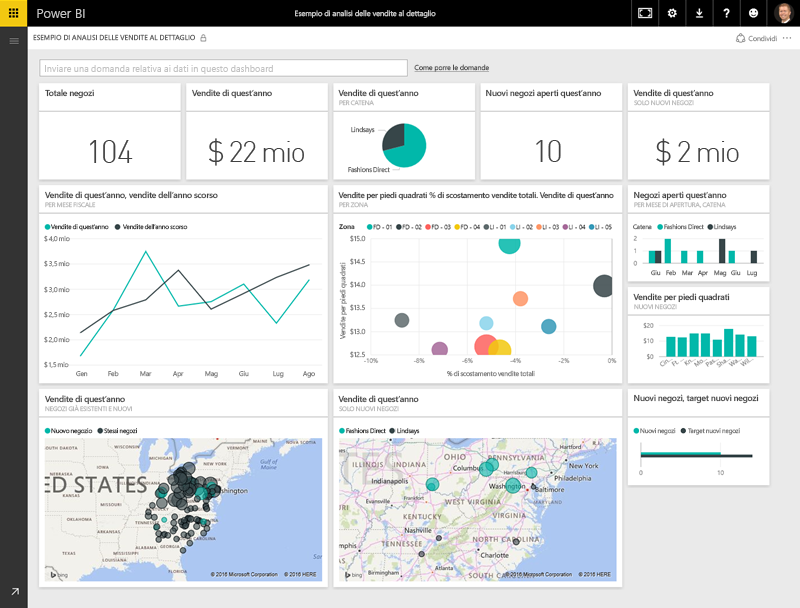
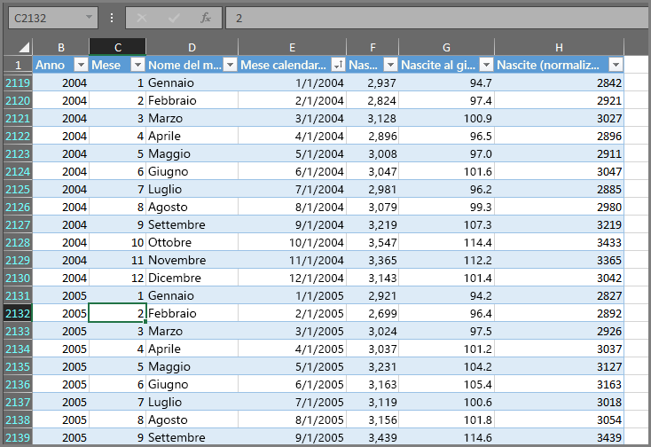
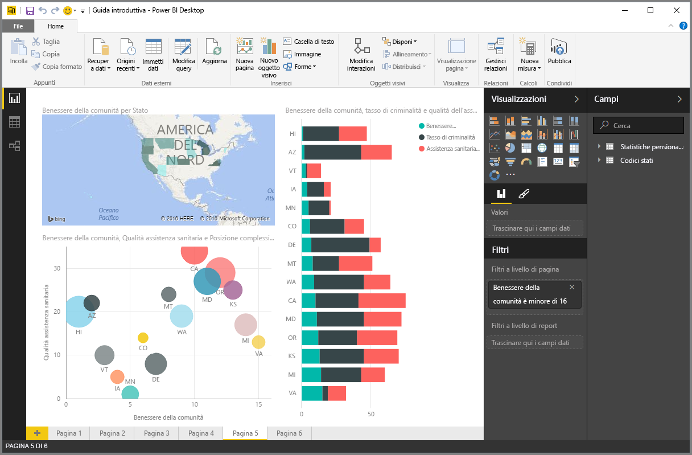
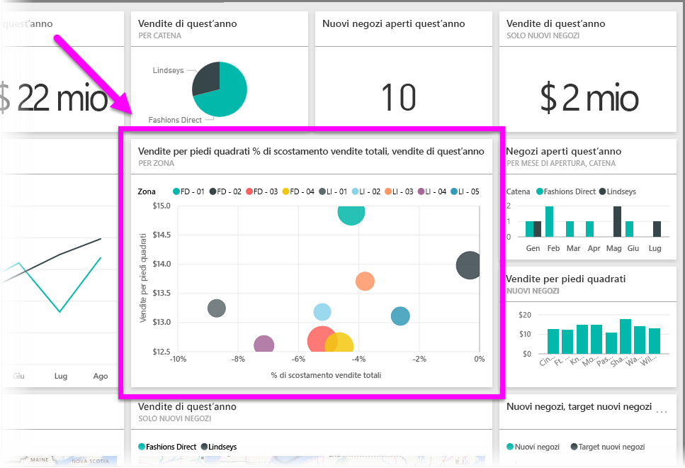

Tutte le operazioni eseguite in Power BI possono essere suddivise in una serie di **blocchi predefiniti** di base. Dopo aver compreso il funzionamento dei blocchi predefiniti, è possibile approfondirne la conoscenza e iniziare a creare report complessi ed elaborati. Dopotutto, anche le strutture apparentemente più complesse vengono realizzate a partire da blocchi predefiniti di base: gli edifici sono fatti di legno, acciaio, cemento e vetro. Gli elementi che compongono le automobili sono metallo, intelaiatura e gomma. Naturalmente, gli edifici e le automobili possono essere strutture semplici o elaborate, a seconda dei blocchi predefiniti di base.

Vediamo che cosa sono questi blocchi predefiniti di base e analizziamo alcune strutture semplici da poter creare, quindi scopriamo anche come realizzare strutture complesse.

I blocchi predefiniti di base in Power BI sono i seguenti:

* Visualizzazioni
* Set di dati
* Relazioni
* Dashboard
* Riquadri

## Visualizzazioni
Una **visualizzazione**, che talvolta viene definita **oggetto visivo**, è una rappresentazione visiva di dati, ad esempio un diagramma, un grafico, una mappa con codifica a colori o altre immagini accattivanti da poter creare per rappresentare visivamente i dati. Power BI include visualizzazioni di ogni tipo il cui numero è in continuo aumento. L'immagine seguente mostra una raccolta di visualizzazioni diverse create nel servizio Power BI.

Le visualizzazioni possono essere semplici, come un singolo numero rappresentativo di un concetto rilevante, o visivamente complesse, ad esempio una mappa che mostra le opinioni degli elettori rispetto a una specifica problematica o questione di interesse sociale tramite sfumature di colore. L'obiettivo di un oggetto visivo è quello di presentare i dati in modo tale da offrire contesto e informazioni, probabilmente difficili da distinguere in una comune tabella composta solo da numeri e testo.

## Set di dati
Un **set di dati** è una raccolta di dati usata da Power BI per creare le visualizzazioni.

È possibile avere un set di dati semplice basato su una singola tabella della cartella di lavoro di Excel, simile a quello mostrato nell'immagine seguente.

I **set di dati** possono essere anche una combinazione di dati con origini diverse, che è possibile filtrare e combinare per restituire un'unica raccolta di dati, cioè un set di dati, da usare in Power BI.

Ad esempio, è possibile creare un set di dati da tre diversi campi di database, una tabella di sito Web, una tabella di Excel e dai risultati online di una campagna di marketing tramite posta elettronica. Questa combinazione unica viene considerata come un singolo **set di dati**, anche se ricavato da origini diverse.

Filtrare i dati prima di trasferirli in Power BI consente di focalizzare l'attenzione su quelli considerati importanti. Ad esempio, è possibile filtrare il database dei contatti in modo che solo i clienti che hanno ricevuto i messaggi di posta elettronica della campagna di marketing siano inclusi nel set di dati. È quindi possibile creare oggetti visivi sulla base del subset, ovvero la raccolta filtrata, di clienti inclusi nella campagna. L'applicazione del filtro consente di mettere a fuoco i dati e concentrare gli sforzi.

Un aspetto importante e vantaggioso di Power BI è la presenza di una grande varietà di **connettori** di dati. Non importa se i dati desiderati si trovano in Excel o in un database SQL, in Azure o in Oracle oppure in un servizio come Facebook, Salesforce o MailChimp: Power BI offre connettori di dati integrati che consentono di connettersi facilmente a questi dati, filtrarli se necessario e inserirli nel set di dati.

Dopo aver creato un set di dati, è possibile generare le visualizzazioni per vedere porzioni distinte dello stesso set di dati in vari modi e approfondire tramite le immagini. A questo punto subentrano i report.

## Relazioni
In Power BI, un **report** è una raccolta di visualizzazioni che compaiono contemporaneamente in una o più pagine. In Power BI, un **report** è una raccolta di elementi correlati tra loro, proprio come un qualsiasi testo scritto per una presentazione di vendita o un compito di scuola. L'immagine seguente mostra un **report** in Power BI Desktop. In questo caso, si tratta della quinta pagina di un report di cinque pagine. È inoltre possibile creare report nel servizio Power BI.

I report consentono di creare molte visualizzazioni, in una serie di pagine diverse se necessario, nonché di disporle nel modo più adatto a trasmettere il messaggio.

È possibile creare report sulle vendite trimestrali, sull'aumento della produzione in un particolare segmento di mercato o sui comportamenti migratori degli orsi polari. A prescindere dall'argomento, i report consentono di raccogliere e organizzare le visualizzazioni in una o più pagine.

## Dashboard
Per condividere una singola pagina del report o una raccolta di visualizzazioni, è possibile creare un **dashboard**. Analogamente al cruscotto di un'automobile, un **dashboard** di Power BI è una raccolta di oggetti visivi presenti in una singola pagina condivisibili con altri utenti. Spesso si tratta di un gruppo selezionato di oggetti visivi volti a offrire informazioni rapide sui dati o sul messaggio che si desidera trasmettere.

Un dashboard deve essere contenuto in una singola pagina, spesso denominata area di disegno. L'area di disegno è lo sfondo vuoto in Power BI Desktop o nel servizio in cui posizionare le visualizzazioni. È possibile immaginarla come la tela di un artista o di un pittore: un'area di lavoro in cui creare, combinare e rielaborare oggetti visivi interessanti e coinvolgenti.
I dashboard possono essere condivisi con altri utenti o gruppi, che possono quindi interagire con il dashboard nel servizio Power BI o sul dispositivo mobile.

## Riquadri
In Power BI, un **riquadro** è una visualizzazione singola reperibile in un report o in un dashboard. È la casella rettangolare contenente ogni singolo oggetto visivo. Nell'immagine seguente viene visualizzato un riquadro, evidenziato in una casella luminosa, circondato anche da altri riquadri.

In fase di *creazione* di un report o di un dashboard in Power BI, è possibile spostare o disporre i riquadri a seconda di come si desidera presentare le informazioni. È possibile aumentarne la dimensione, modificarne l'altezza o la larghezza e avvicinarli ad altri riquadri nel modo desiderato.

Se si sta *visualizzando* o *usando* un dashboard o un report condivisi dai relativi autori e proprietari, è possibile interagire senza tuttavia poter modificare le dimensioni e la disposizione dei riquadri.

## Riepilogo
Queste sono le nozioni di base di Power BI e dei relativi blocchi predefiniti. Quello che segue è un breve ripasso.

Power BI è una raccolta di servizi, app e connettori che consente di connettersi ai dati, ovunque risiedano, filtrarli se necessario, quindi spostarli in Power BI in cui è possibile creare visualizzazioni coinvolgenti da poter condividere con altri utenti.  

Dopo aver compreso il funzionamento dei blocchi predefiniti di Power BI, è ovviamente possibile creare set di dati *considerati importanti* e report visivamente accattivanti in grado di trasmettere il messaggio. Un messaggio trasmesso con Power BI non deve essere necessariamente complesso o complicato per risultare accattivante.

Per alcune persone, l'uso di una singola tabella di Excel in un set di dati e la condivisione di un dashboard con il team rappresentano un modo di lavorare con Power BI incredibilmente efficace.

Per altri utenti, l'uso di tabelle in tempo reale di Azure SQL Data Warehouse in combinazione con altri database e origini in tempo reale, che poi vengono filtrate in tempo reale per creare un set di dati che monitori costantemente l'avanzamento della produzione, è il valore che desiderano trovare in Power BI.

In ogni caso, il processo è lo stesso: creare set di dati, elaborare oggetti visivi accattivanti e condividerli con altri utenti. Allo stesso modo, il risultato è per tutti lo stesso: sfruttare il mondo in continua espansione dei dati per ricavare informazioni utili.

Non importa se le informazioni dettagliate sui dati necessitano di set di dati semplici o complessi: Power BI offre un avvio rapido e la possibilità di espandersi in base alle esigenze fino al livello di complessità adeguato all'insieme di dati. Power BI è un prodotto Microsoft, quindi è solido, estendibile, supportato da Office e di classe enterprise.

Ecco come funziona. Inizieremo con una panoramica del servizio Power BI.

