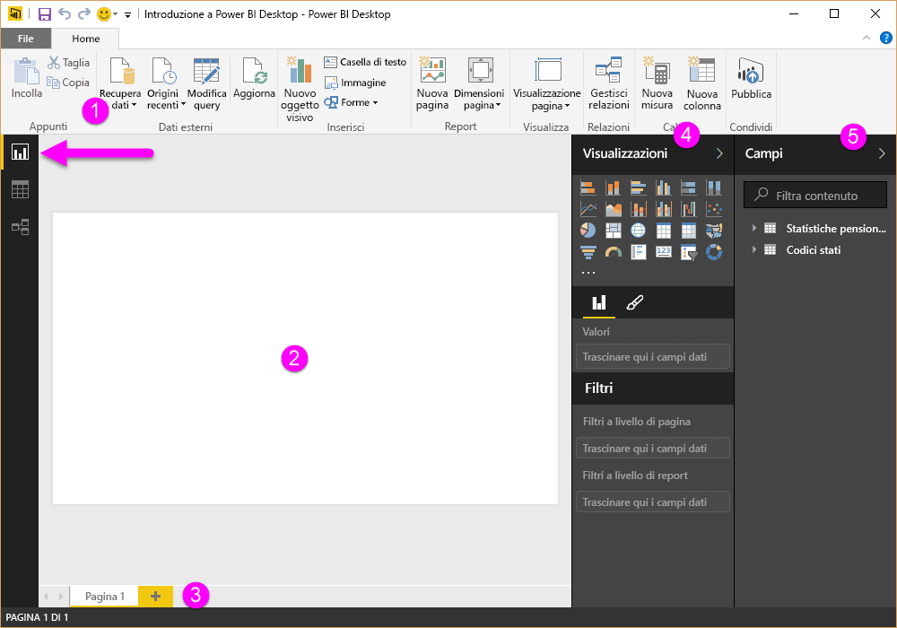
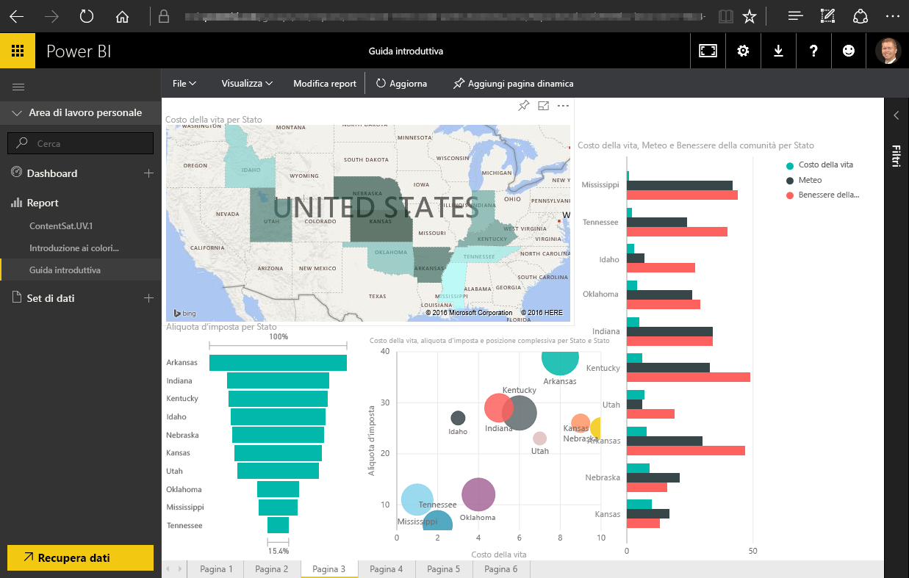

In questo argomento, approfondiremo lo svolgimento delle prime due fasi di Power BI:

* Creare un report in **Power BI Desktop**
* Pubblicare il report nel **servizio Power BI**

Inizieremo con Power BI Desktop selezionando **Recupera dati**. Verrà visualizzata la raccolta di origini dati che consentirà di scegliere un'origine dati. L'immagine seguente mostra la selezione di una pagina Web come origine. Nel video precedente, Will ha selezionato una cartella di lavoro di **Excel**.

A prescindere dall'origine dati selezionata, Power BI si connette all'origine dati e mostra i dati disponibili. L'immagine seguente è un altro esempio da una pagina Web che analizza diversi paesi e alcune statistiche interessanti sul pensionamento.

Nella vista **Report** di Power BI Desktop è possibile iniziare a creare report.

La vista **Report** include cinque aree principali:

1. La barra multifunzione, che mostra le attività comuni associate ai report e alle visualizzazioni.
2. La vista **Report** , o area di disegno, dove vengono create e disposte le visualizzazioni.
3. La scheda **Pagine** nella parte inferiore, che consente di selezionare o aggiungere una pagina del report.
4. Il riquadro **Visualizzazioni** , dove è possibile modificare le visualizzazioni, personalizzare i colori o gli assi, applicare filtri, trascinare i campi e altro ancora.
5. Il riquadro **Campi** in cui gli elementi della query e i filtri possono essere trascinati nella vista **Report** oppure nell'area **Filtri** del riquadro **Visualizzazioni** .

I riquadri **Visualizzazioni** e **Campi** possono essere compressi selezionando la piccola freccia lungo il bordo, in modo da ottenere più spazio nella vista **Report** per la creazione di visualizzazioni accattivanti. Quando si modificano le visualizzazioni, vengono visualizzate anche queste frecce rivolte verso l'alto o verso il basso, che indicano che è possibile espandere o comprimere la sezione.

Per creare una visualizzazione, trascinare un campo dall'elenco **Campi** alla vista **Report** . In questo caso, trascinare il campo State da *RetirementStats* e vedere che cosa succede.

Osservare cosa accade... Power BI Desktop ha creato automaticamente una visualizzazione basata su mappa, dopo aver riconosciuto che il campo State includeva dati di georilevazione.

Andiamo rapidamente avanti e, dopo aver creato un report con alcune visualizzazioni, saremo pronti per pubblicarlo nel servizio Power BI. Nella barra multifunzione **Home** in Power BI Desktop selezionare **Pubblica**.

Verrà richiesto di accedere a Power BI.

Dopo che l'accesso è stato effettuato e il processo di pubblicazione è stato completato, viene visualizzata la finestra di dialogo seguente. Selezionare il collegamento riportato sotto **Operazione riuscita** per passare al servizio Power BI dove visualizzare il report appena pubblicato.

Quando si accede a Power BI, è possibile visualizzare il file Power BI Desktop appena pubblicato nel servizio. Nell'immagine riportata sotto, il report creato in Power BI Desktop viene visualizzato nella sezione **Report**.

Nel report è possibile scegliere l'icona a forma di **puntina** per aggiungere l'oggetto visivo a un dashboard. L'immagine seguente mostra l'icona a forma di puntina evidenziata da una casella colorata e una freccia.

Selezionandola, verrà visualizzata la finestra di dialogo seguente, che consentirà di aggiungere l'oggetto visivo a un dashboard esistente o di creare un nuovo dashboard.

Quando si aggiungono oggetti visivi ricavati dal report, è possibile visualizzarli nel dashboard.

Si può fare molto di più con Power BI, naturalmente, ad esempio condividere i dashboard creati. Parleremo della condivisione più avanti in questo corso.

Successivamente, esamineremo una funzionalità che consente di creare automaticamente i dashboard semplicemente tramite la connessione a un servizio cloud come Facebook, Salesforce e molti altri.

