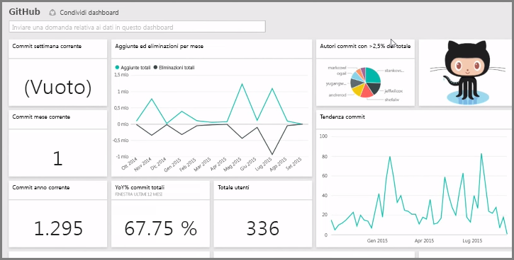

Come illustrato precedentemente, il comune flusso di lavoro in Power BI consiste nel creare un report in Power BI Desktop, pubblicarlo nel servizio Power BI, quindi condividerlo con altri utenti e consentire di visualizzarlo nel servizio o in un'app per dispositivi mobili.

Tuttavia, poiché alcune persone iniziano con il servizio Power BI, è importante offrire una breve presentazione e scoprire un modo semplice ed efficace di creare oggetti visivi in Power BI in tempi rapidi: i *pacchetti di contenuto*.

Un **pacchetto di contenuto** è una raccolta di oggetti visivi e report preconfigurati e predefiniti basati su origini dati specifiche, ad esempio Salesforce. Usare un pacchetto di contenuto equivale a riscaldare nel microonde un piatto già pronto o ordinare la cena in un fast-food di qualità: con pochi clic e qualche commento, è possibile fruire di una serie di elementi perfettamente assemblati, tutti confezionati in modo impeccabile e pronti all'uso.

Vediamo che cosa sono i pacchetti di contenuto, il servizio e come funziona. Nelle sezioni successive analizzeremo i pacchetti di contenuto e il servizio più nel dettaglio. Questo è solo un assaggio per stimolare l'appetito.

## Creare dashboard pronti all'uso con i servizi cloud
È facile connettersi ai dati con Power BI. Dal servizio Power BI basta selezionare il pulsante **Recupera dati** nell'angolo in basso a sinistra della schermata iniziale.

L'*area di disegno*, ovvero l'area al centro del servizio Power BI, mostra le origini dei dati disponibili. Oltre alle comuni origini dati, ad esempio i file di Excel, i database o i dati di Azure, Power BI può connettersi con la stessa facilità ai **servizi software**, detti anche provider SaaS o servizi cloud, ad esempio Salesforce, Facebook, Google Analytics e un intero assortimento di altri servizi SaaS.

Per questi servizi software, il **servizio Power BI** offre una raccolta di oggetti visivi predefiniti, organizzati in dashboard e report che prendono il nome di **pacchetti di contenuto**. I pacchetti di contenuto garantiscono l'operatività in tempi rapidi in Power BI con dati provenienti dal servizio selezionato. Ad esempio, quando si usa il pacchetto di contenuto Salesforce, Power BI si connette all'account Salesforce di cui sono state indicate le credenziali, quindi popola una raccolta predefinita di oggetti visivi e dashboard in Power BI.

Power BI offre pacchetti di contenuto per tutti i tipi di servizi. L'immagine seguente mostra la prima schermata dei servizi in ordine alfabetico, visualizzata quando si seleziona **Recupera** dalla casella **Servizi** come nell'immagine precedente. Come si vede dall'immagine riportata di seguito, le opzioni tra cui scegliere sono numerose.

In questo caso, verrà scelto **GitHub**. GitHub è un'applicazione per il controllo del codice sorgente online. Dopo aver immesso le informazioni e le credenziali per il pacchetto di contenuto GitHub, il servizio inizia a importare i dati.

Quando i dati sono stati caricati, viene visualizzato il dashboard del pacchetto di contenuto GitHub predefinito.

Oltre al **dashboard**, è disponibile anche il **report** generato come parte del pacchetto di contenuto GitHub per creare il dashboard, insieme al **set di dati**, ovvero la raccolta di dati estratti da GitHub, generato durante l'importazione dei dati e usato per creare il report GitHub.

Nel dashboard, è possibile fare clic su uno qualsiasi degli oggetti visivi per andare automaticamente alla pagina **Report** da cui è stato creato l'oggetto visivo. Facendo clic sull'oggetto visivo **Top 5 users by pull requests (Primi 5 utenti per richieste pull)** , Power BI aprirà la pagina **Richieste pull** in Report, ovvero la pagina Report da cui è stato creato l'oggetto visivo.

## Porre domande sui dati
È possibile inoltre porre domande sui dati e ottenere in risposta oggetti visivi pertinenti creati in tempo reale dal servizio Power BI. Nell'immagine seguente, si può vedere in che modo Power BI crea un oggetto visivo numerico per indicare il conteggio dei problemi risolti sulla base delle informazioni digitate nella barra di **query in linguaggio naturale**.

Se è presente un oggetto visivo interessante, è possibile selezionare l'icona a forma di **puntina** a destra della barra di query in linguaggio naturale per aggiungerlo al dashboard. In questo caso, l'oggetto visivo viene aggiunto al dashboard GitHub perché è questo il dashboard attualmente selezionato.

## Aggiornamento dei dati nel servizio Power BI
È possibile anche scegliere di **aggiornare** il set di dati per un pacchetto di contenuto o altri dati usati in Power BI. Per impostare gli aggiornamenti, selezionare i tre puntini di sospensione accanto a un set di dati e visualizzare il menu.

Selezionare l'opzione **Pianifica aggiornamento** in fondo al menu. La finestra di dialogo Impostazioni viene quindi visualizzata nell'area di disegno, consentendo l'impostazione degli aggiornamenti in base alle esigenze.

Termina qui questa breve presentazione del servizio Power BI. Il servizio consente di eseguire molte altre operazioni, che verranno trattate più avanti in questo corso. Esistono molti tipi diversi di dati a cui potersi connettere nonché pacchetti di contenuto di ogni genere, il cui numero è in continuo aumento.

Passiamo ora al prossimo argomento, dove riepilogheremo questa sezione **introduttiva** e consolideremo le nostre conoscenze.

