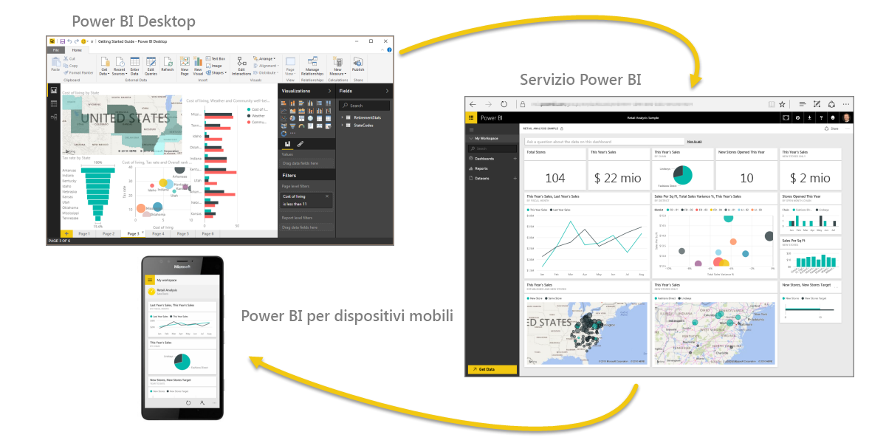

Ripassiamo brevemente gli argomenti trattati nella prima sezione.

**Power BI** è una raccolta di servizi software, app e connettori che interagiscono tra loro per trasformare i dati in un insieme di informazioni interattive. È possibile usare i dati ricavati da singole origini di base, ad esempio una cartella di lavoro di Excel, o estrarre i dati da più database e origini cloud per creare report e set di dati complessi. Power BI può essere estremamente semplice o raggiungere la complessità adeguata a un prodotto di classe enterprise per aziende di livello mondiale.

Power BI è composto da tre elementi principali: il **Power BI Desktop**, il **servizio Power BI** e **Power BI per dispositivi mobili**. La collaborazione tra questi elementi consente di creare, condividere, usare e interagire con i dati in base alle esigenze.

Abbiamo presentato i blocchi predefiniti di base in Power BI, che sono:

* **Visualizzazioni**: una rappresentazione visiva dei dati, talvolta indicate come oggetti visivi
* **Set di dati**: una raccolta di dati usata da Power BI per creare visualizzazioni
* **Report**: una raccolta di oggetti visivi di un set di dati, in una o più pagine
* **Dashboard**: una raccolta su singola pagina di oggetti visivi ricavati da un report
* **Riquadri**: una visualizzazione singola ricavata da un report o un dashboard

Successivamente, abbiamo presentato una panoramica di Power BI in un tour video guidato da **Will Thompson**. Will ha illustrato brevemente come analizzare e visualizzare i dati con Power BI.

<!---
In **Power BI Desktop**, we connected to a basic Excel file, created visualizations, then published those visualizations to the service. Even if you use Power BI only with your Excel workbooks, you can gain amazing visual insights with those Excel workbooks, and both interact and share it in ways never before possible.
-->
Nel **servizio Power BI** abbiamo creato un dashboard in pochi clic. Abbiamo proseguito con uno sguardo al servizio Power BI e usato un **pacchetto di contenuto**, ovvero una raccolta predefinita di oggetti visivi e report, quindi abbiamo eseguito la connessione a un **servizio software** per popolare il pacchetto di contenuto e dare vita ai dati.

Abbiamo usato anche query in linguaggio naturale, dette **Domande e risposte**, per porre domande e consentire a Power BI di rispondere creando oggetti visivi. Infine, abbiamo impostato una **pianificazione degli aggiornamenti** per i dati affinché siano aggiornati nel servizio Power BI.

## Passaggi successivi
**Congratulazioni!** La prima sezione del corso di **apprendimento guidato** per Power BI è stata completata. Grazie a una solida conoscenza di base, è ora possibile passare alla prossima sezione, **Acquisizione dei dati**, la fase successiva nel flusso di lavoro logico per Power BI.

È importante ripetere che questo corso incrementa le conoscenze seguendo il comune flusso di lavoro in Power BI:

* Importare i dati in **Power BI Desktop** e creare un report
* **Pubblicare** nel servizio Power BI, dove creare nuove visualizzazioni o dashboard
* **Condividere** i dashboard con altri utenti, soprattutto con chi è in viaggio
* Visualizzare e interagire con i dashboard e i report condivisi nelle app **Power BI per dispositivi mobili**

Non sempre vengono sfruttate tutte le funzionalità: alcuni si limitano a visualizzare, nel servizio, i dashboard creati da altri. Tuttavia, questo corso *attraversa* tutte le fasi, offrendo la possibilità di *imparare* a creare i dashboard e a connetterli ai dati, fino a consentirne la realizzazione in completa autonomia.

Arrivederci nella prossima sezione.

