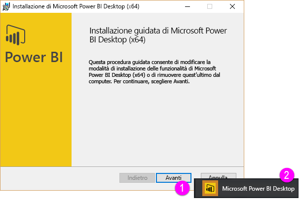

Benvenuti nella seconda sezione di questo corso di **apprendimento guidato** per Power BI, denominata **Acquisizione dei dati**. Questa sezione illustra molte funzionalità e numerosi strumenti incentrati sui dati in Power BI, con un'attenzione particolare per Power BI Desktop. Molti strumenti si applicano anche al servizio Power BI, quindi si apprenderà il doppio delle nozioni in questa sezione.

Quando si recuperano i dati, a volte non si trovano nel formato corretto o non sono abbastanza *puliti* come si desidera. In questa sezione si imparerà a recuperare i dati e a pulirli, un'operazione che a volte prende il nome di *pulizia* o *trasformazione* dei dati, oltre a conoscere alcuni utili suggerimenti per agevolarne il recupero.

Come sempre in questo corso, le fasi dell'apprendimento seguiranno il flusso di lavoro in Power BI. Detto questo, analizziamo il punto da cui spesso si parte, ovvero **Power BI Desktop**.

## Una panoramica di Power BI Desktop
Power BI Desktop è uno strumento che consente di connettersi ai dati, pulirli e visualizzarli. Con Power BI Desktop, è possibile connettersi ai dati, quindi modellarli e visualizzarli in modi diversi. La maggior parte degli utenti che lavorano su progetti di business intelligence usano principalmente Power BI Desktop.

È possibile scaricare Power BI Desktop [dal Web](http://go.microsoft.com/fwlink/?LinkID=521662), installare **Power BI Desktop** come app da [**Windows Store**](http://aka.ms/pbidesktopstore) oppure scaricarlo dal servizio Power BI. Per ottenere **Power BI Desktop** nel servizio è sufficiente selezionare il pulsante con la freccia rivolta verso il basso posto in alto a destra in Power BI, quindi fare clic su Power BI Desktop.

Power BI Desktop viene installato come un'applicazione nel computer Windows.

Dopo averlo scaricato, Power BI Desktop verrà installato ed eseguito come altre applicazioni in Windows. L'immagine seguente mostra la schermata iniziale di Power BI Desktop, che viene visualizzata all'avvio dell'applicazione.

Power BI Desktop si connette a un'ampia gamma di origini dati, dal database locale ai fogli di lavoro di Excel fino ai servizi cloud. Consente di pulire e formattare i dati per poterli sfruttare al meglio, oltre a includere suddivisione e ridenominazione delle colonne, modifica dei tipi di dati e uso delle date. È inoltre possibile creare relazioni tra le colonne per semplificare la modellazione e l'analisi dei dati.

