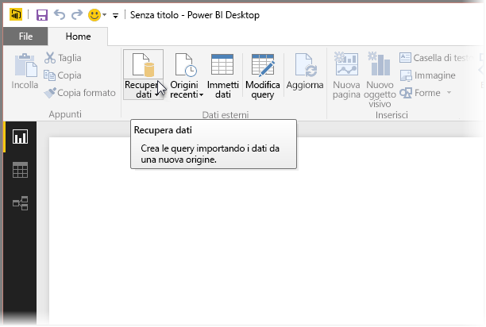
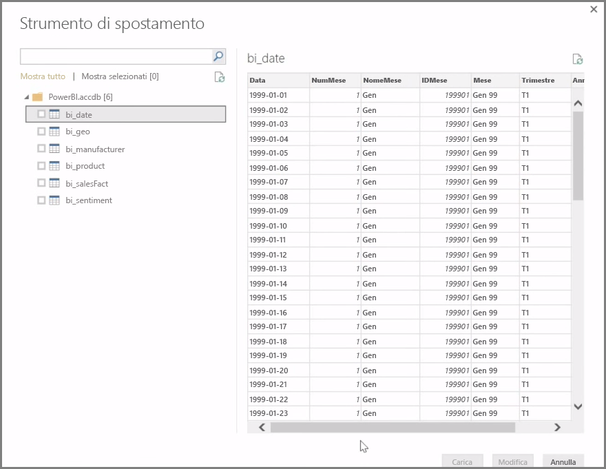
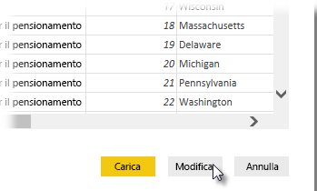

**Power BI Desktop** può connettersi a un ampio intervallo di origini dati, inclusi i database locali, le cartelle di lavoro di Excel e i servizi cloud. Attualmente, oltre 59 servizi cloud diversi, ad esempio GitHub e Marketo, dispongono di connettori specifici ed è possibile connettersi a origini generiche tramite estensioni xml, csv, testo e ODBC. Power BI recupera persino i dati tabulari direttamente da un URL di sito Web. Iniziamo aprendo Power BI Desktop ed eseguendo la connessione ai dati.

Dopo aver avviato **Power BI Desktop** e aver superato la schermata iniziale, è possibile scegliere Recupera dati dalla barra multifunzione della scheda **Home**.

Sono disponibili aggiornamenti mensili a Power BI Desktop e, con ogni aggiornamento, la pagina **Novità di Power BI Desktop** viene aggiornata con le informazioni sugli aggiornamenti, i collegamenti al blog e un collegamento di download.

In Power BI Desktop sono disponibili origini dati di ogni tipo. Selezionare un'origine per stabilire una connessione. A seconda della selezione, verrà richiesto di individuare l'origine nel computer o nella rete oppure di accedere a un servizio per autenticare la richiesta.

Dopo aver eseguito la connessione, la prima finestra visualizzata sarà **Strumento di navigazione**. Lo Strumento di navigazione consente di visualizzare le tabelle o entità dell'origine dati e, facendo clic su una di queste, si aprirà un'anteprima dei relativi contenuti. È quindi possibile importare all'istante le tabelle o entità selezionate oppure scegliere **Modifica** per trasformare e pulire i dati prima dell'importazione.

Dopo aver selezionato le tabelle che si desidera importare in Power BI Desktop, è possibile scegliere di caricarle in Power BI Desktop selezionando il pulsante **Carica** nell'angolo in basso a destra di **Strumento di navigazione**. Tuttavia, in alcuni casi si dovranno apportare modifiche alle tabelle prima di caricarle in Power BI Desktop. È possibile selezionare un singolo subset di clienti o filtrare i dati di vendita relativi a un paese specifico. In questi casi, è possibile selezionare il pulsante Modifica e il filtro o trasformare i dati prima di importarli tutti in Power BI Desktop.

Riprenderemo da qui per modificare i dati nella sezione successiva.

