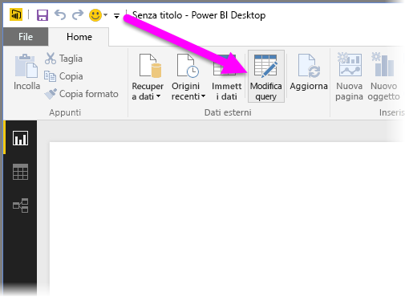
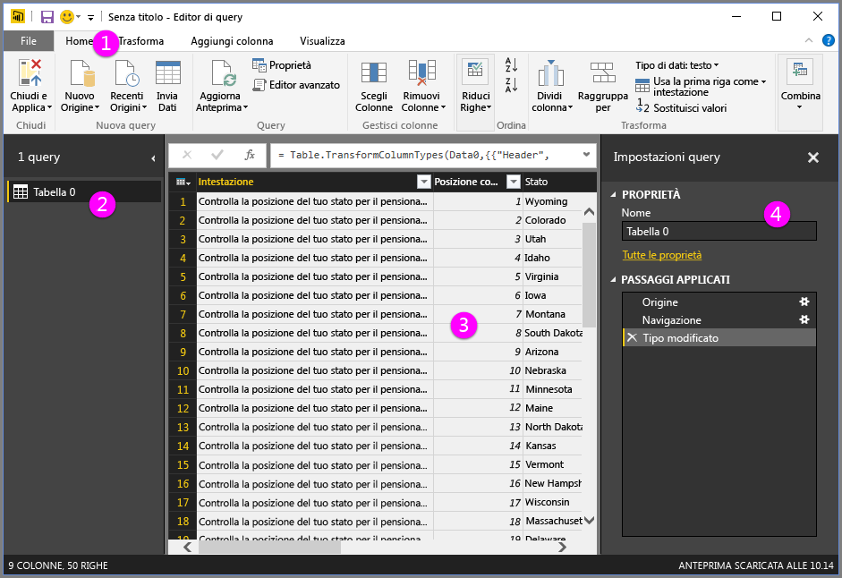
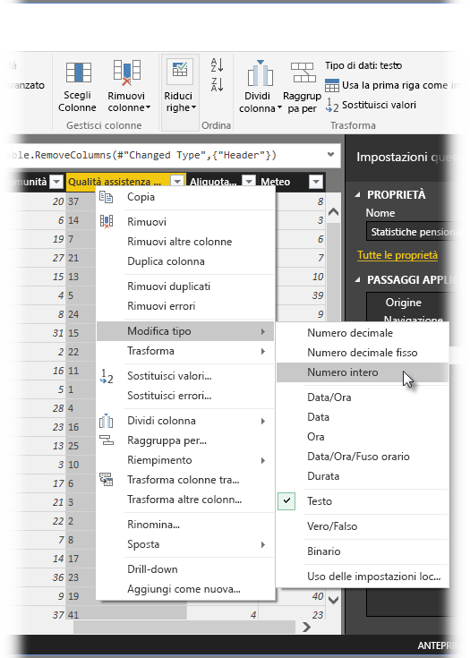
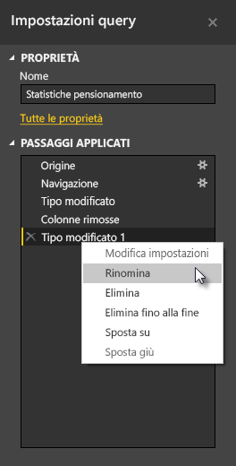
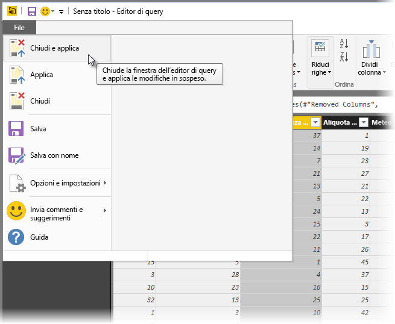
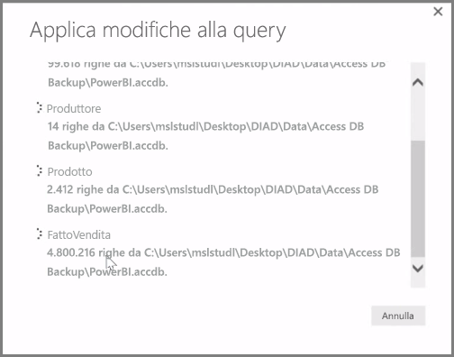

**Power BI Desktop** include l'**Editor di query**, un potente strumento per data shaping e trasformazione dei dati in grado di renderli idonei per modelli e visualizzazioni. L'opzione Modifica dello Strumento di navigazione consente di avviare l'Editor di query e popolarlo con tabelle o altre entità selezionate dall'origine dati.

È anche possibile avviare l'**Editor di query** direttamente da **Power BI Desktop** tramite il pulsante **Modifica query** nella barra multifunzione **Home**.

Dopo aver caricato nell'Editor di Query i dati da sottoporre al data shaping , vengono visualizzate alcune sezioni:

1. Nella barra multifunzione, molti pulsanti sono ora attivi per interagire con i dati nella query
2. Nel riquadro a sinistra, le query vengono elencate e rese disponibili per la selezione, la visualizzazione e il data shaping, una per ogni tabella o entità.
3. Nel riquadro centrale, vengono visualizzati i dati della query selezionata, disponibili per il data shaping
4. Viene visualizzata la finestra Impostazioni query, che elenca le proprietà della query e i passaggi applicati

Nel riquadro centrale, facendo clic con il pulsante destro del mouse su una colonna, viene visualizzata una serie di diverse possibili trasformazioni, ad esempio la rimozione della colonna dalla tabella, la duplicazione della colonna con un nuovo nome e la sostituzione di valori. Da questo menu è inoltre possibile dividere le colonne di testo in più parti per delimitatori comuni.

La barra multifunzione dell'**Editor di Query** include altri strumenti, ad esempio la modifica del tipo di dati delle colonne, l'aggiunta della notazione scientifica o l'estrazione di elementi dalle date come il giorno della settimana.

Quando si applicano le trasformazioni, ogni passaggio viene visualizzato nell'elenco **Passaggi applicati** del riquadro **Impostazioni query** sul lato destro dell'**Editor di query**. È possibile usare l'elenco per annullare o rivedere le modifiche specifiche oppure modificare il nome di un passaggio. Per salvare le trasformazioni, selezionare **Chiudi e applica** nella scheda **Home**.

Dopo aver selezionato **Chiudi e applica**, l'Editor di query applicherà le modifiche di query apportate in Power BI Desktop.

È possibile eseguire ogni genere di operazioni durante la trasformazione dei dati nell'**Editor di query**, tra cui trasformazioni avanzate. Nella sezione successiva, esamineremo alcune di queste trasformazioni avanzate per avere un'idea delle possibilità quasi illimitate offerte dall'**Editor di query** nella trasformazione dei dati.

