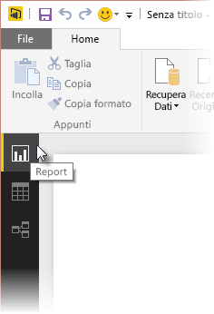
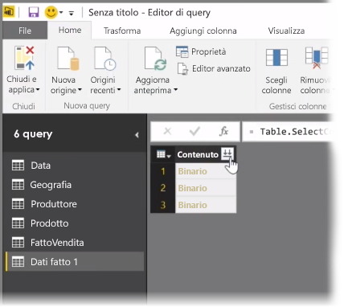
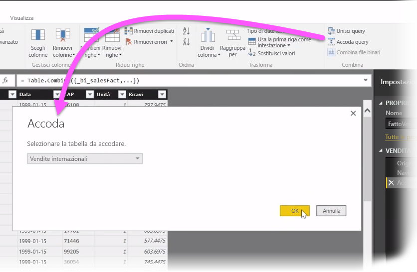
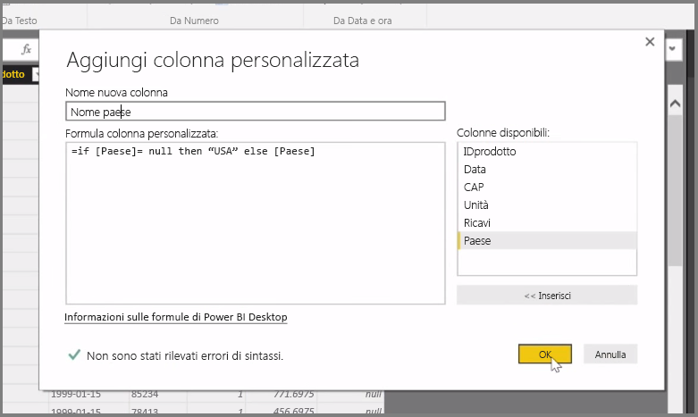

In questo articolo ci occupiamo dell’analisi di alcune tecniche avanzate di pulizia e importazione dei dati per **Power BI Desktop**. Dopo aver dato forma ai dati in **dell'Editor di Query** e averli portati in **Power BI Desktop**, è possibile esaminarli in diversi modi. In Power BI Desktop sono disponibili tre viste: vista **Report**, vista **Dati** e vista **Relazioni**. Ciascuna visualizzazione è visibile selezionando la relativa icona sul lato superiore sinistro dell'area di disegno. Nella figura seguente, è selezionata la visualizzazione **Report**. La barra gialla accanto all'icona indica la visualizzazione attiva.

Per modificare la visualizzazione, selezionare una delle altre due icone. La barra gialla accanto all'icona indica la visualizzazione attiva.

Power BI Desktop consente di combinare dati da più origini in un singolo report, in qualsiasi momento durante il processo di modellazione. Per aggiungere origini aggiuntive a un report esistente, selezionare **Modifica query** sulla barra multifunzione **Home** e quindi selezionare **Nuova origine** nell’**Editor di Query**.

Esistono molte diverse origini dati possibili utilizzabili in **Power BI Desktop**, incluse le cartelle. Connettendosi a una cartella, è possibile importare dati da più file contemporaneamente, ad esempio una serie di file Excel o di file CSV. I file contenuti all'interno della cartella selezionata vengono visualizzati nell’**Editor di Query** come contenuto binario e facendo clic sull'icona a doppia freccia nella parte superiore della colonna **Contenuto** sono caricati i relativi valori.

Uno degli strumenti più utili di Power BI è costituito da *Filtri*. Ad esempio, selezionando la freccia giù accanto a una colonna viene visualizzato un elenco di filtri testuali che consente di rimuovere i valori dal modello.

È inoltre possibile unire e accodare query e trasformare più tabelle (o dati da diversi file, in cartelle) in un’unica tabella che contiene solo i dati desiderati. È possibile utilizzare lo strumento **Accoda query** strumento per aggiungere i dati da una nuova tabella a una query esistente. Power BI Desktop tenta di associare le colonne nelle query, che è quindi possibile modificare in base alle esigenze in **dell'Editor di Query**.

Infine, lo strumento **Aggiungi colonna personalizzata** offre agli utenti esperti la possibilità di scrivere espressioni di query da zero utilizzando il potente linguaggio di M. È possibile aggiungere una colonna personalizzata in base alle istruzioni del linguaggio di query M e ottenere i dati nel modo desiderato.

