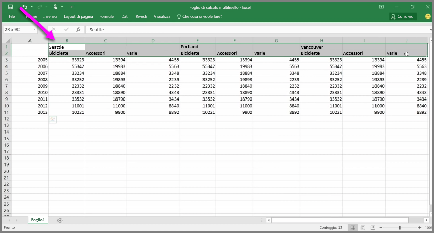
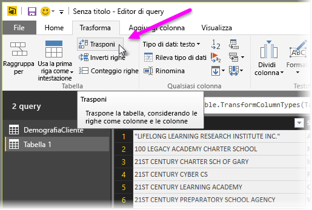
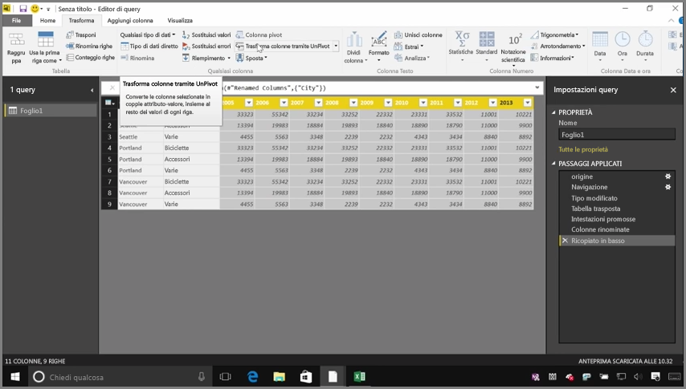
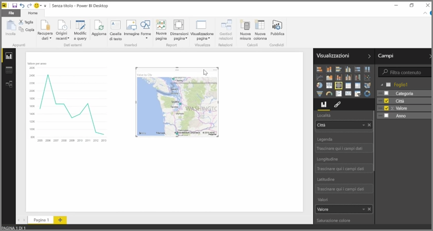

Mentre Power BI può importare i dati da quasi ogni origine, gli strumenti di visualizzazione e modellazione operano meglio con i dati disposti in colonne. Talvolta i dati non vengono formattati in semplici colonne, come spesso capita con i fogli di calcolo di Excel: il layout della tabella può sembrare adeguato all'occhio umano ma non necessariamente ottimale ai fini delle query automatizzate. Ad esempio, il foglio di calcolo seguente contiene intestazioni che si estendono su più colonne.

Fortunatamente, Power BI offre strumenti per trasformare rapidamente le tabelle a più colonne in set di dati che è possibile usare.

## Trasporre i dati
Ad esempio, usando **Trasponi** nell'**Editor di query**, è possibile capovolgere i dati, cioè trasformare le colonne in righe e viceversa, per suddividere i dati in formati da poter manipolare.

Dopo aver eseguito queste operazioni più di una volta, come illustrato nel video, la tabella inizierà ad assumere la forma che Power BI riesce a gestire più facilmente.

## Formattare i dati
A volte è necessario formattare i dati per consentire a Power BI di classificarli correttamente e identificarli dopo l'importazione.

Con una vasta gamma di trasformazioni, tra cui *la conversione di righe in intestazioni*, l'uso di **Riempimento** per trasformare i valori *null* in valori riportati sopra o sotto una determinata colonna, quindi **Trasforma colonne tramite UnPivot**, è possibile eseguire la pulizia dei dati in un set di dati da usare in Power BI.

Con Power BI, è possibile sperimentare queste trasformazioni nei dati e determinare quali sono quelle che consentono di formattarli in colonne e che permettono a Power BI di usarli. Tutte le azioni eseguite vengono registrate nella sezione Passaggi applicati dell'Editor di query: se una trasformazione non funziona nel modo desiderato basterà fare clic sulla **x** accanto al passaggio e annullare l'operazione.

## Creare oggetti visivi
Dopo aver organizzato i dati in un formato adeguato per Power BI, tramite trasformazioni e operazioni di pulizia, è possibile iniziare a creare oggetti visivi.

## Passaggi successivi
**Congratulazioni!** Questa sezione del corso di **apprendimento guidato** per Power BI è stata completata. Si conosce ora il modo di **ottenere i dati** in Power BI Desktop e di *modellarli* o *trasformarli* per creare oggetti visivi accattivanti.

Il prossimo passo per capire il funzionamento di Power BI e come adattarlo *alle proprie esigenze* è quello di scoprire che cos'è la **modellazione**. Come illustrato, un **set di dati** è un blocco predefinito di base di Power BI, ma alcuni set di dati possono essere complessi e basarsi su diverse origini dei dati. In alcuni casi, è necessario aggiungere al set di dati creato un tocco speciale (o *campo*).

Nella sezione successiva si apprenderà che cos'è la **modellazione** e molto altro. Ci vediamo lì!

