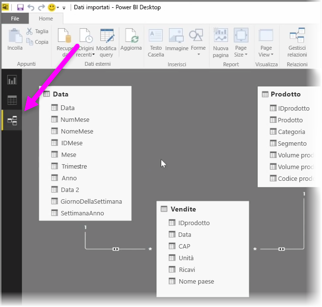
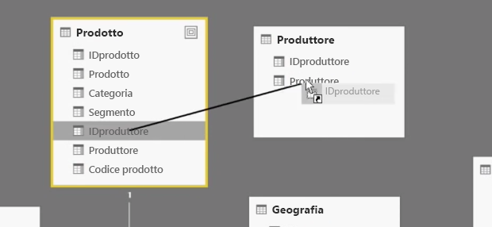
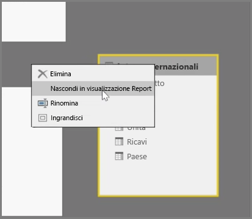
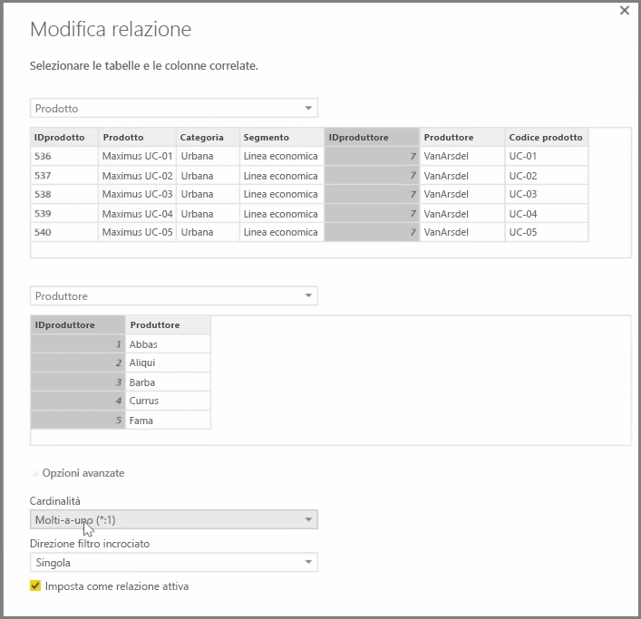

Power BI consente di indicare tramite immagini la relazione tra tabelle o elementi. Per ottenere un diagramma dei dati usare la **vista Relazione**, disponibile all'estrema sinistra della schermata accanto all'area di disegno Report.

Nella vista **Relazioni** è possibile visualizzare un blocco per ogni tabella con le rispettive colonne, insieme alle linee che ne definiscono le relazioni.

Aggiungere e rimuovere le relazioni è semplice. Per rimuovere una relazione, fare clic con il pulsante destro del mouse sulla relazione e selezionare **Elimina**. Per creare una relazione, trascinare i campi che si desidera mettere in collegamento tra le tabelle.

Per nascondere una tabella o una singola colonna del report, fare clic con il pulsante destro del mouse sull'elemento interessato nella vista Relazione e selezionare **Nascondi in visualizzazione Report**.

Per visualizzare più dettagli delle relazioni tra i dati, selezionare **Gestisci relazioni** nella scheda **Home**. Si aprirà la finestra di dialogo **Gestisci relazioni** che consente di visualizzare le relazioni come un elenco anziché un diagramma visivo. Da qui è possibile selezionare **Rilevamento automatico** per individuare le relazioni nei dati nuovi o aggiornati. Selezionare **Modifica** nella finestra di dialogo **Gestisci relazioni** per modificare manualmente le relazioni. Sono disponibili qui anche le opzioni avanzate per impostare la *Cardinalità* e la *Direzione filtro incrociato* delle relazioni.

Le opzioni per Cardinalità sono *Molti-a-uno* e *Uno-a-uno*. *Molti-a-uno* è la relazione tra il tipo di fatti e il tipo di dimensioni, ad esempio una tabella di vendite con più righe per ogni prodotto collegata a una tabella in cui a ogni riga corrisponde un prodotto. L'opzione *Uno-a-uno* viene spesso usata per collegare singole voci nelle tabelle di riferimento.

Per impostazione predefinita, il filtro incrociato per le relazioni riguarda entrambe le direzioni. Il filtro incrociato in una sola direzione limita alcune delle funzionalità di modellazione in una relazione.

Impostare relazioni accurate tra i dati consente di creare calcoli complessi tra più elementi dati.

