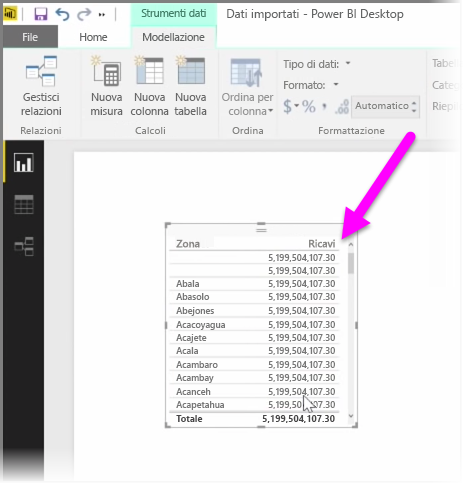
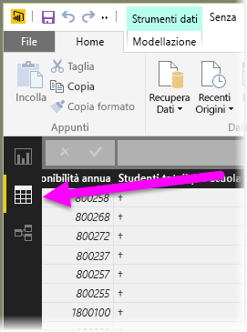
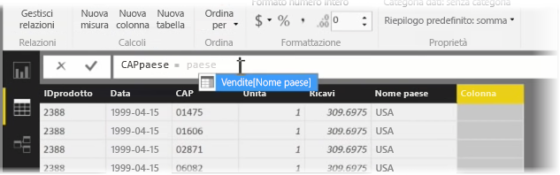
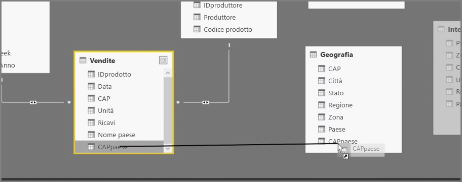
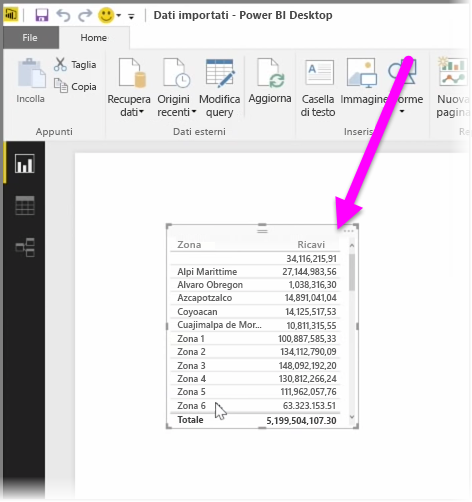

La creazione di colonne calcolate è un modo semplice per arricchire e migliorare i dati. Una **colonna calcolata** è una nuova colonna creata mediante la definizione di un calcolo che trasforma o combina due o più elementi di dati esistenti. Ad esempio, è possibile creare una nuova colonna unendone due.

Una ragione valida per creare una colonna calcolata è quella di stabilire una relazione tra tabelle quando non sono presenti campi univoci da poter usare per stabilire una relazione. L'assenza di una relazione è evidente quando si crea un semplice oggetto visivo in formato tabella in Power BI Desktop e si ottiene lo stesso valore per tutte le voci anche se i dati sottostanti sono diversi.

Per creare una relazione con i campi univoci nei dati, è possibile, ad esempio, creare una nuova colonna calcolata per "Numero di telefono completo" combinando i valori delle colonne "Prefisso" e "Numero locale" quando questi valori sono presenti nei dati. Le colonne calcolate sono uno strumento utile per la creazione rapida di modelli e visualizzazioni.

Per creare una colonna calcolata, selezionare **Vista dati** in Power BI Desktop dal lato sinistro dell'area di disegno del report.

Dalla scheda Creazione di modelli selezionare **Nuova colonna**. Verrà così abilitata la barra della formula in cui è possibile immettere i calcoli tramite linguaggio DAX (Data Analysis Expressions). DAX è un potente linguaggio di formule, disponibile anche in Excel, che consente di creare calcoli affidabili. Nel digitare una formula, Power BI Desktop consente di visualizzare le formule corrispondenti o gli elementi dati per facilitare e accelerare la creazione della formula.

La barra della formula di Power BI suggerirà funzioni DAX specifiche e le relative colonne di dati mentre si immette un'espressione.

Dopo aver creato le colonne calcolate in ogni tabella, queste possono essere usate come chiave univoca per stabilire la relazione reciproca. Passando alla vista **Relazione** è quindi possibile trascinare il campo da una tabella all'altra per creare la relazione.

Ritornando alla vista **Report** è ora possibile visualizzare un valore diverso per ogni area.

È possibile eseguire molte altre operazioni quando si crea una colonna calcolata.

