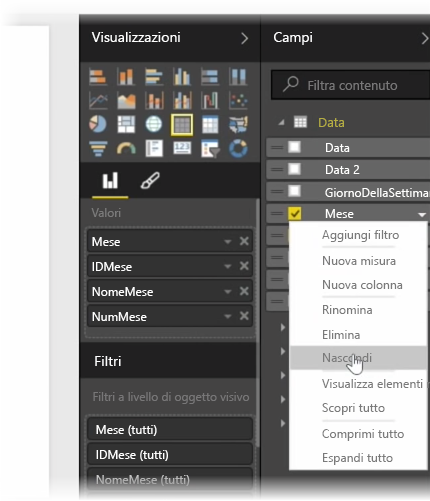
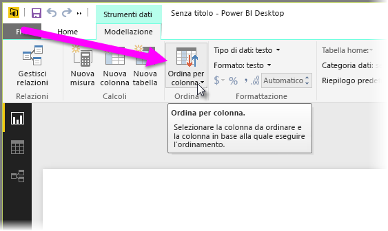
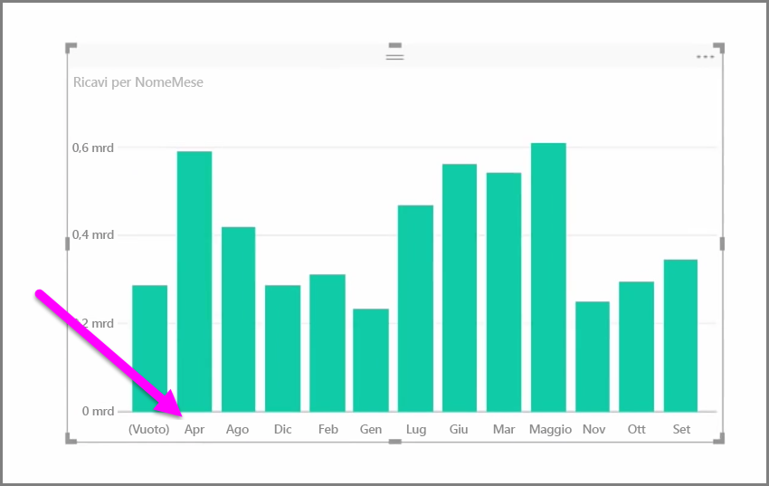
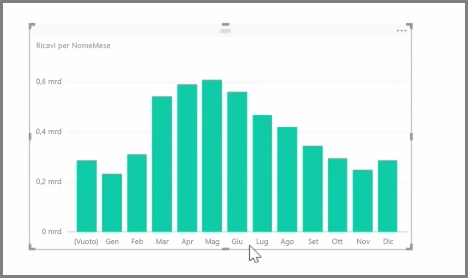

I dati importati spesso contengono campi che non sono così rilevanti ai fini della generazione di report e visualizzazioni o perché si tratta di informazioni in più o perché sono già disponibili in un'altra colonna. Power BI Desktop offre strumenti per ottimizzare i dati e consentirne un migliore impiego nella creazione di report e oggetti visivi, nonché per visualizzare i report condivisi.

## Nascondere i campi
Per nascondere una colonna nel riquadro **Campi** di Power BI Desktop, fare clic con il pulsante destro del mouse e selezionare **Nascondi**. Notare che le colonne nascoste non vengono eliminate. Se si utilizza quel campo nelle visualizzazioni del momento, i dati saranno comunque inclusi nell'oggetto visivo e sarà ancora possibile usarli in altre visualizzazioni, con la differenza che il campo nascosto non verrà visualizzato nel riquadro **Campi**.

Se vengono visualizzate tabelle nella vista **Relazioni**, i campi nascosti appariranno in grigio. Anche in questo caso, i dati sono ancora disponibili e inclusi nel modello anche se nascosti. È sempre possibile scoprire i campi nascosti facendo clic con il pulsante destro del mouse sul campo e selezionando **Scopri**.

## Ordinare i dati delle visualizzazioni secondo un campo diverso
Lo strumento **Ordina per colonna**, disponibile nella scheda **Creazione di modelli**, è molto utile per garantire che i dati vengano visualizzati nell'ordine desiderato.

Un esempio comune è quello per cui i dati che includono il nome del mese vengono ordinati alfabeticamente per impostazione predefinita, quindi "agosto" precede "febbraio".

In questo caso, selezionare il campo nell'elenco Campi, quindi fare clic su **Ordina per colonna** nella scheda **Creazione di modelli** e infine scegliere il campo secondo il quale devono essere ordinati gli elementi sono operazioni che consentono di risolvere il problema. L'opzione di ordinamento della categoria "NumMese" consente di ordinare i mesi come desiderato.

Impostare il tipo di dati per un campo è un altro modo per ottimizzare le informazioni e consentirne una gestione corretta. Per modificare un tipo di dati dall'area di disegno dei report selezionare la colonna nel riquadro **Campi**, quindi un'opzione di formattazione dal menu a discesa **Formato**. Tutti gli oggetti visivi creati che includono quel campo vengono così aggiornati automaticamente.

