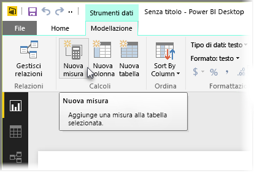
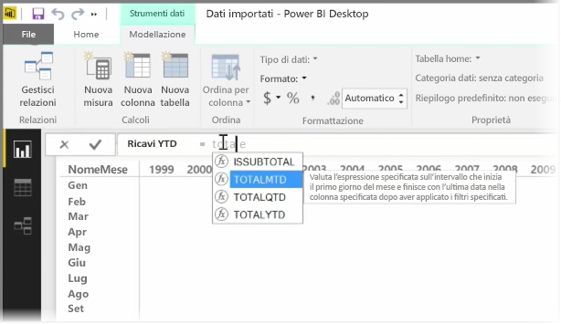
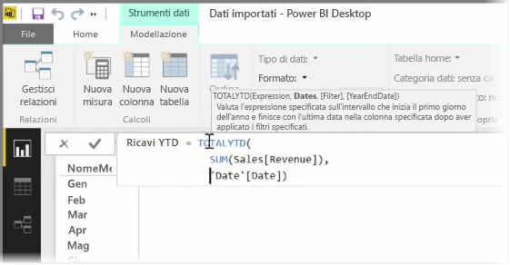
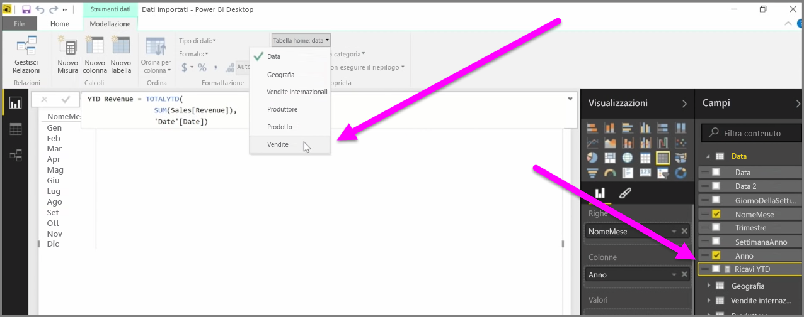

Una *misura* è un calcolo esistente nel modello di dati di Power BI. Per creare una misura, nella vista **Report** selezionare **Nuova misura** dalla scheda **Creazione di modelli**.

Uno dei principali vantaggi di DAX, il linguaggio Data Analysis Expression in Power BI, è la disponibilità di molte funzioni utili, soprattutto per i calcoli basati sul tempo, ad esempio *da inizio anno* o *rispetto all'anno precedente*. Con DAX, è possibile definire una misura di tempo una volta, quindi dividerla per il numero di campi desiderati secondo il modello di dati.

In Power BI, un determinato calcolo prende il nome di *misura*. Per creare una *misura*, selezionare **Nuova misura** dalla scheda **Home**. Verrà visualizzata la Barra della formula in cui è possibile immettere l'espressione DAX che definisce la misura. Nel momento in cui il calcolo viene digitato, Power BI suggerisce funzioni DAX e campi di dati pertinenti e viene anche visualizzata una descrizione comando relativa ad alcuni parametri di sintassi e funzioni.

Se il calcolo è particolarmente lungo, è possibile aggiungere più interruzioni di riga nell'Editor espressioni digitando **ALT-Enter**.

La nuova misura appena creata verrà visualizzata in una delle tabelle nel riquadro **Campi** posto sul lato destro della schermata. Power BI inserisce la nuova misura nella tabella attualmente selezionata e, a prescindere dalla posizione nei dati, la misura potrà essere facilmente spostata tramite il menu a discesa **Tabella home**.

È possibile usare una misura come qualsiasi altra colonna della tabella: basta trascinarla nell'area di disegno del report o nei campi della visualizzazione. Inoltre, le misure si integrano perfettamente con i filtri dei dati che segmentano i dati in tempo reale. Questo significa che è possibile definire una misura una sola volta e usarla in molte visualizzazioni diverse.

La funzione DAX **Calcola** è un potente strumento per ogni genere di calcolo, particolarmente utile per la creazione di report e oggetti visivi di tipo finanziario.

