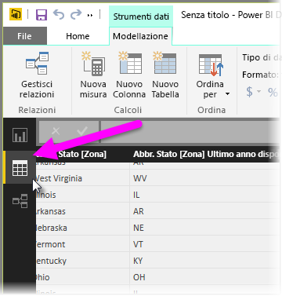
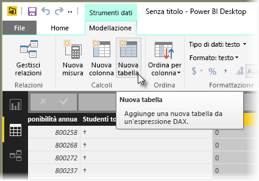
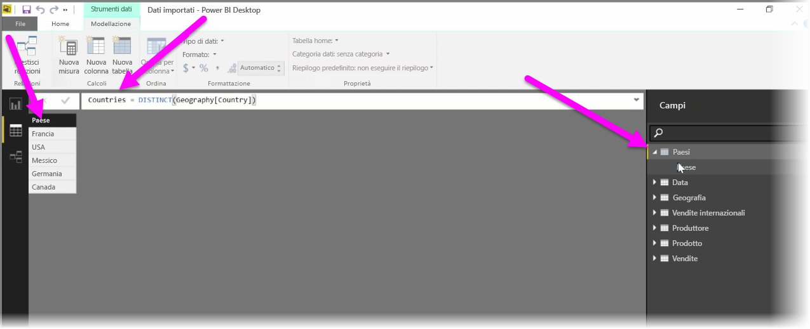

Le tabelle calcolate sono una funzione all'interno di DAX che consente di esprimere un ampio intervallo di nuove funzionalità di modellazione. Ad esempio, se si desidera eseguire diversi tipi di merge join o creare nuove tabelle in tempo reale in base ai risultati di una formula funzionale, le tabelle calcolate sono lo strumento adatto per farlo.

Per creare una tabella calcolata, andare a **Vista dati** in Power BI Desktop, attivabile dal lato sinistro dell'area di disegno del report.

Selezionare **Nuova tabella** dalla scheda Creazione di modelli per aprire la barra della formula.

Digitare il nome della nuova tabella a sinistra del segno di uguale e il calcolo che si desidera usare per creare la tabella a destra. Dopo aver completato il calcolo, la nuova tabella viene visualizzata nel riquadro Campi del modello.

È possibile usare la tabella creata come qualsiasi altra tabella nelle relazioni, nelle formule e nei report.

