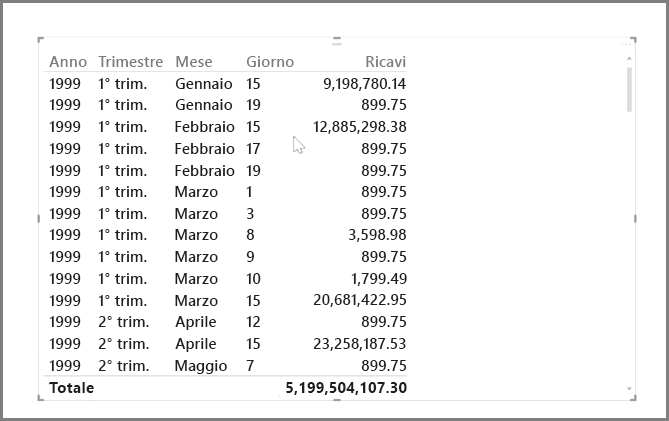
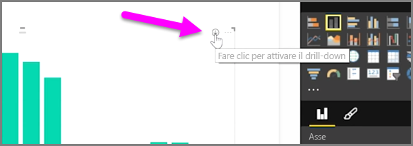
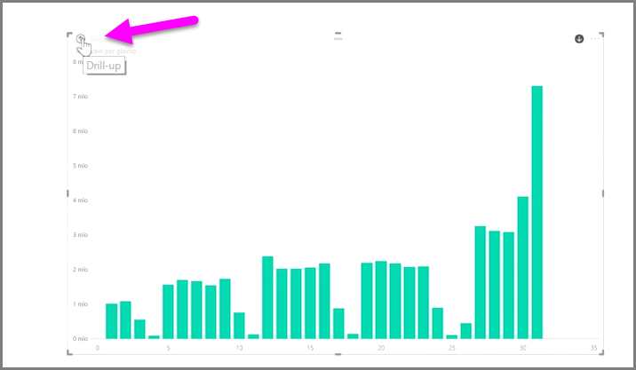
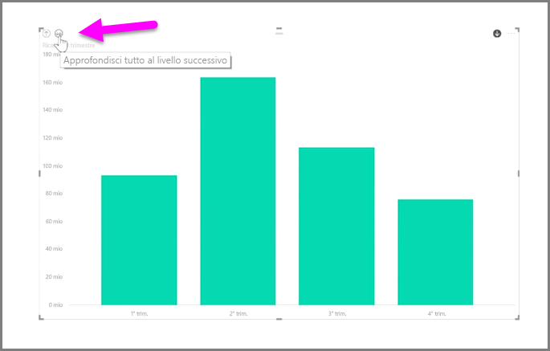
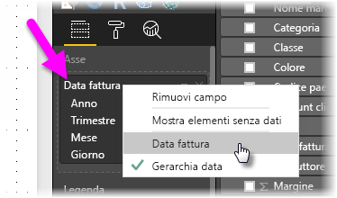
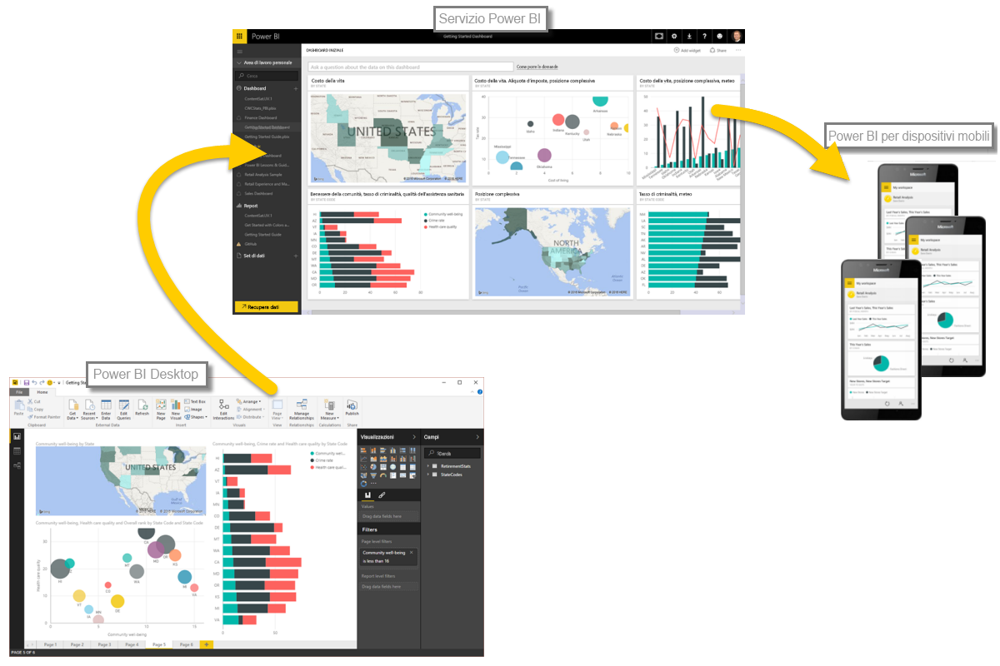

Con Power BI è facile analizzare i dati basati sul tempo. Gli strumenti di modellazione in Power BI Desktop includono campi generati automaticamente che consentono di eseguire il drill-down in anni, trimestri, mesi e giorni con un solo clic.  

Quando si crea una visualizzazione di tabella nel report usando un campo di data, Power BI Desktop include automaticamente suddivisioni basate sul periodo di tempo. Ad esempio, il singolo campo relativo alla data nella tabella **Data** è stato automaticamente suddiviso in colonne relative ad anno, trimestre, mese e giorno da Power BI, come illustrato nella figura seguente.

Le visualizzazioni mostrano i dati a livello di *anno* per impostazione predefinita, ma è possibile modificare questa impostazione attivando l'opzione **Drill-down** nell'angolo superiore destro dell'oggetto visivo.

Ora quando si fa clic sulle barre o sulle linee nel grafico, viene eseguito il drill-down nel livello successivo della gerarchia temporale, ad esempio da *anni* a *trimestri*. È possibile continuare a eseguire il drill-fino a raggiungere il livello più granulare della gerarchia, che in questo esempio è *giorni*. Per spostarsi verso l'alto nella gerarchia temporale, fare clic su **Drill-up** nell'angolo superiore sinistro dell'oggetto visivo.

È anche possibile eseguire il drill-down in tutti i dati presenti nell'oggetto visivo, invece che in un periodo selezionato, usando l'icona a forma di freccia doppia **Mostra tutto fino al livello successivo**, anch'essa nell'angolo superiore destro dell'oggetto visivo.

Se il modello contiene un campo di data, Power BI genera automaticamente visualizzazioni diverse per gerarchie temporali diverse.

Per tornare alla date singole anziché usare la gerarchia temporale, fare semplicemente clic con il pulsante destro del mouse sul nome della colonna nell'area **Campi** (nella figura seguente, il nome della colonna è *InvoiceDate*), quindi selezionare il nome della colonna dal menu visualizzato, anziché **Gerarchia data**. L'oggetto visivo mostra quindi i dati in base ai dati di tale colonna, senza usare la gerarchia temporale. Se è necessario riprendere a usare la gerarchia temporale, basta fare di nuovo clic con il pulsante destro del mouse e selezionare **Gerarchia data** dal menu.

## Passaggi successivi
**Congratulazioni!** Questa sezione del corso di **apprendimento guidato** per Power BI è stata completata. Ora che è stato appreso il concetto di*modellazione* dei dati è possibile passare alla parte più coinvolgente, illustrata nella sezione seguente: le **Visualizzazioni**.

Come già spiegato, questo corso consente di approfondire le conoscenze seguendo il comune flusso di lavoro in Power BI:

* Importare i dati in **Power BI Desktop** e creare un report
* Pubblicare nel servizio Power BI, dove è possibile creare nuove **visualizzazioni** e dashboard
* **Condividere** i dashboard con altri utenti, soprattutto con chi è in viaggio
* Visualizzare i dashboard e i report condivisi nelle app **Power BI per dispositivi mobili** e interagire con essi

Anche se non si dovranno svolgere tutte le attività in prima persona, sarà possibile *capire* come sono stati creati i dashboard e come si connettono ai dati e alla fine del corso si sarà in grado di crearne uno in completa autonomia.

Arrivederci nella prossima sezione.

