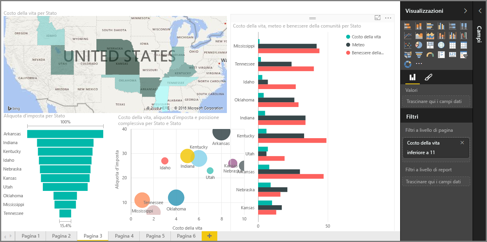

Benvenuto nella sezione sulle **Visualizzazioni** del corso di **apprendimento guidato** per Power BI. Preparati a seguire una presentazione divertente, interessanti e stimolante delle numerosissime visualizzazioni offerte da Power BI. E non sono tutte: le visualizzazioni aumentano di continuo.

Naturalmente, gli oggetti visivi sono il risultato finale di qualsiasi operazione di business intelligence e offrono la possibilità di estrarre i dati, presentarli in modo interessante e dettagliato e *mostrare* i risultati. Power BI dispone di tutti i tipi di oggetti visivi principali e offre infinite possibilità di personalizzazione. Per questo motivo, questa sezione è molto importante.

Questa sezione appare ricca di argomenti, ma niente paura: ogni argomento è breve, pieno di oggetti visivi, come potrai immaginare, e facile da apprendere. Probabilmente ti sorprenderai a navigare nella sezione, immaginando i modi in cui gli oggetti visivi possono aiutarti a presentare i tuoi dati.

Inizieremo dalla base delle visualizzazioni, ovvero gli oggetti visivi che tutti conosciamo, per garantire che si conoscano tutti i dettagli. Quindi passeremo ad argomenti più avanzati, o meno comuni, per riempire il set di strumenti per la creazione di report.

Buon divertimento, c'è tanto da imparare qui.

## Introduzione agli oggetti visivi in Power BI
La visualizzazione dei dati è una delle parti principali di Power BI, un blocco di compilazione di base come è stata definita in precedenza in questo corso, e la creazione di oggetti visivi è il modo più semplice per trovare e condividere informazioni dettagliate.

Power BI vanta un'ampia gamma di visualizzazioni disponibili per impostazione predefinita, da semplici grafici a barre a grafici a torta, fino alle mappe e proposte ancora più particolari come grafici a cascata, grafici a imbuto, misuratori e altro ancora. Power BI Desktop offre anche strumenti avanzati per la formattazione della pagina, come forme e immagini, che consentono di dare vita al report.

