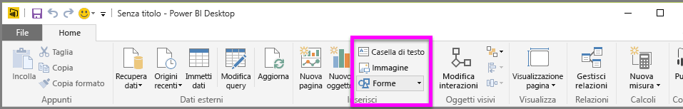
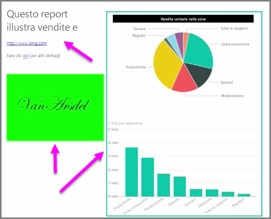

Insieme agli oggetti visivi associati a dati, è anche possibile aggiungere elementi statici, ad esempio caselle di testo, immagini e forme per migliorare il progetto dei report. Per aggiungere un oggetto visivo, selezionare **Casella di testo**, **Immagine** o **Forme** dalla scheda **Home**.

**Caselle di testo** è il modo ideale per visualizzare titoli di grandi dimensioni, didascalie o brevi paragrafi di informazioni con le visualizzazioni. Le caselle di testo possono includere collegamenti, tramite un URL scritto oppure evidenziando una frase di ancoraggio e selezionando il simbolo di collegamento sulla barra delle opzioni della casella di testo. È possibile includere gli URL nelle caselle di testo. Power BI rileva automaticamente il collegamento e lo attiva.

**Immagine** consente di aprire un visualizzatore di file in cui è possibile selezionare l'immagine dal computer o da un'altra origine in rete. Per impostazione predefinita, il ridimensionamento di un'immagine nel report manterrà le proporzioni, ma può essere disattivato dalle opzioni di formattazione dell'oggetto visivo.

**Forme** offre cinque diverse opzioni di forma,tra cui rettangoli e frecce. Le forme possono essere opache o trasparenti, con bordo colorato. Il bordo colorato risulta utile per creare i bordi intorno a gruppi di visualizzazioni.

