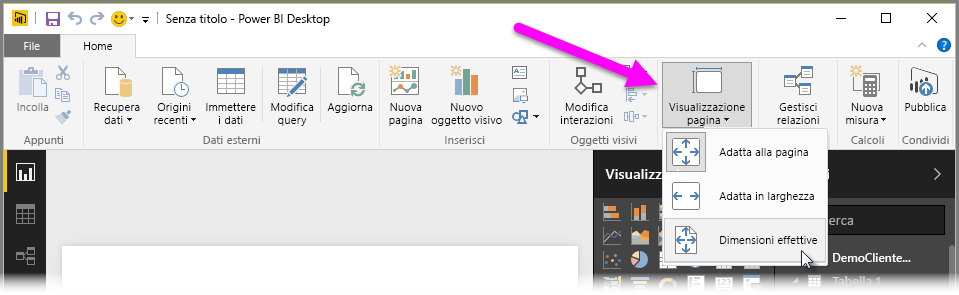

Power BI Desktop ti consente di controllare il layout e la formattazione delle pagine del report, ad esempio dimensioni e orientamento.

Utilizza il menu **Visualizzazione pagina** dalla scheda Home per modificare scala delle pagine del report. Le opzioni disponibili includono **Adatta alla pagina** (predefinito), **Adatta in larghezza** e **Dimensioni effettive**.

È inoltre possibile modificare le dimensioni della pagina stessa. Per impostazione predefinita, le pagine del report sono 16:9. Per modificare le dimensioni della pagina, verificare che non siano selezionati oggetti visivi, quindi selezionare l'icona del pennello nel riquadro di visualizzazione, quindi selezionare **Dimensioni pagina** per espandere la sezione.

Le opzioni per la dimensione della pagina includono 4x3 (altre proporzioni quadrate) e Dinamico (la pagina sarà adattata per riempire lo spazio disponibile). Per i report è previsto inoltre un formato Lettera standard. Tenere presente che potrebbe essere necessario ridimensionare gli oggetti visivi dopo la modifica delle dimensioni della pagina, per accertarsi che siano completamente nell'area di disegno.

È inoltre possibile specificare una dimensione di pagina personalizzata, impostandola indicando pollici o pixel e modificare il colore di sfondo dell'intero report.

Un'altra opzione consiste nel selezionare Cortana, che consente di adattare il report in modo che possa essere utilizzato, di conseguenza per le ricerche mediante Cortana.

