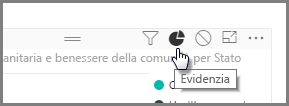

Quando si dispone di più visualizzazioni nella stessa pagina del report, la selezione di un particolare segmento, facendo clic o utilizzando un filtro dei dati avrà effetto su tutti gli oggetti visivi in tale pagina. In alcuni casi, tuttavia, è consigliabile suddividere gli oggetti visivi specifici. Ciò vale soprattutto quando si utilizzano elementi quali grafici a dispersione, nei casi in cui la limitazione dei dati da un segmento specifico comporta la rimozione di un significato fondamentale. Fortunatamente, Power BI Desktop consente di controllare le modalità di flusso delle interazioni tra gli oggetti visivi.

Per modificare l'interazione tra le visualizzazioni, selezionare **Modifica** dalla sezione Oggetti visivi della barra multifunzione **Home** per attivare o disattivare **la modalità di modifica**.

>[!NOTE]
>L’icona **Modifica interazioni** in Power BI Desktop è stato modificata dopo la registrazione del video.
> 
> 

A questo punto quando si seleziona un elemento visivo sull'area di disegno del report, verrà visualizzata l’icona di un piccolo *filtro* opaco nell'angolo superiore destro di ogni altro oggetto visivo interessato. Per escludere un oggetto visivo dall'interazione, fare clic sul simbolo *Nessuno* nell'angolo superiore destro, accanto all’icona del *filtro*.

In alcuni casi è possibile modificare il tipo di interazione del filtro applicato tra gli oggetti visivi. Con la **modalità di modifica** attivata, selezionare l'oggetto visivo utilizzato per filtrare. Se è possibile modificare il tipo di interazione in un altro oggetto visivo, verrà visualizzata l’icona di un *grafico a torta* accanto all'icona del filtro nell'angolo superiore destro.

Fare clic sull’icona del *grafico a torta* per evidenziare i dati segmentati. In caso contrario, i dati verranno filtrati. Come in precedenza, è possibile fare clic sull’icona *Nessuno* per rimuovere tutte le interazioni.

Un utile suggerimento di progettazione consiste nel disegnare una forma trasparente per gli oggetti visivi che interagiscono tra loro, in modo che sia chiaro per l'utente che dispone di una relazione interattiva.

