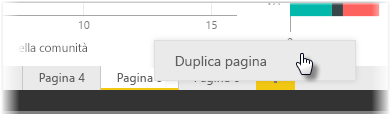

Le singole pagine di un report possono essere piuttosto complesse, con più visualizzazioni che interagiscono in modi specifici e hanno una formattazione precisa. In alcuni casi, quando si crea un report, può capitare di voler usare gli stessi oggetti visivi e layout per due pagine dedicate ad argomenti diversi. Se, ad esempio, è appena stata creata una pagina di un report sui ricavi lordi, si potrebbe voler creare una pagina sui ricavi netti quasi identica.

Ricreare tutto il lavoro sarebbe difficile, ma con Power BI Desktop è possibile semplicemente duplicare una pagina del report.

Fare clic con il pulsante destro del mouse sulla scheda che si vuole copiare e scegliere **Duplica pagina**.

Sarà quindi possibile rinominare la nuova scheda della pagina come necessario, aggiornare il testo del titolo, se è presente, e quindi aggiornare gli oggetti visivi con il nuovo campo di cui si vuole tenere traccia.

