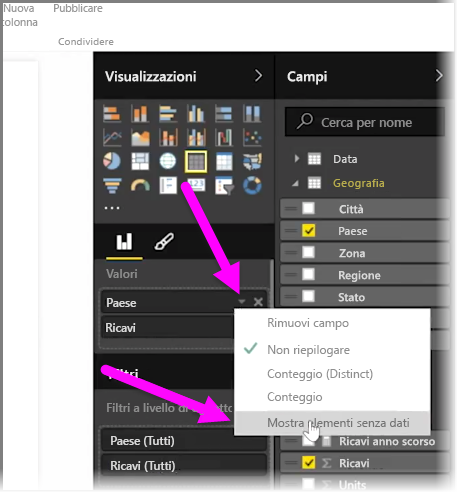
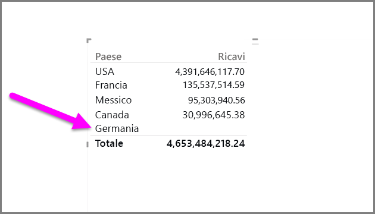
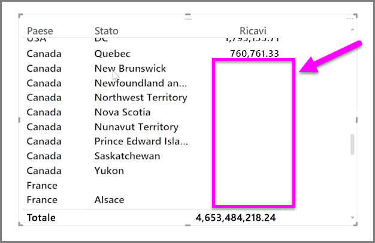

Per impostazione predefinita, le intestazioni di colonna vengono visualizzate nei report solo se contengono dati. Se, ad esempio, si stanno visualizzando i ricavi in base al paese e non sono state concluse vendite in Norvegia, la Norvegia non sarà presente nella visualizzazione.

Per visualizzare le categorie vuote, fare clic sulla freccia rivolta verso il basso nel campo da modificare nel riquadro **Visualizzazioni** e selezionare **Mostra elementi senza dati**.

Nell'oggetto visivo verranno ora visualizzate le colonne vuote senza valori.

Dopo aver selezionato **Mostra elementi senza dati** per un campo nel riquadro **Visualizzazioni**, questa impostazione si applica a tutti i campi presenti nel riquadro Visualizzazioni. Se quindi si aggiunge un altro campo, verranno mostrati anche tutti gli elementi che non hanno dati, senza che sia necessario usare di nuovo il menu di scelta rapida.

