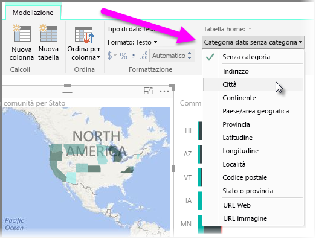

Power BI dispone di proprietà che è possibile assegnare ai campi nel modello, che consentono di segnalare e visualizzare e presentare i dati in modo da fornire maggiore chiarezza. Ad esempio, talvolta si desidera calcolare la media di un elenco di numeri, tuttavia Power BI esegue automaticamente la somma dell'elenco. Con Power BI, è possibile modificare la modalità di riepilogo di tali elenchi di numeri.

## Controllo numerico rispetto alla visualizzazione
Verrà esaminato un esempio e viene illustrato come controllare il modo in cui Power BI riepiloga i campi di dati numerici.

Selezionare un oggetto visivo sull'area di disegno del report e quindi selezionare un campo del riquadro **Campi**. La scheda **Modellazione** viene visualizzata nella barra multifunzione e visualizza le opzioni per la formattazione dei dati e le proprietà dei dati.

È possibile selezionare il tipo di simbolo della valuta, selezionando l’elenco a discesa del simbolo della valuta, come illustrato nell'immagine seguente.

Esistono diverse opzioni per la formattazione dei campi. Ad esempio, è possibile modificare il formato della valuta in percentuale.

È anche possibile modificare il modo in cui Power BI riepiloga i dati. Selezionare l’icona **Riepilogo predefinito** per modificare la modalità di riepilogo di un campo, tra cui la visualizzazione di una somma, un conteggio o una media.

## Gestire e chiarire i dati di posizione
Durante la tracciatura di percorsi su una mappa, è possibile apportare modifiche analoghe. Selezionare la mappa e quindi selezionare il campo nel riquadro **Campi** utilizzato per il valore *Percorso*. Nella scheda **Modellazione**, selezionare la **Categoria dei dati** e quindi scegliere la categoria che rappresenta i dati di posizione dal menu a discesa. Selezionare ad esempio, città, provincia o stato.

