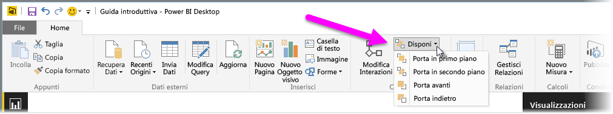
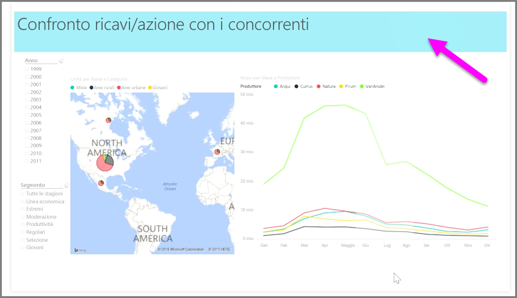

Quando in un report sono presenti molti elementi, Power BI consente di gestire la modalità di sovrapposizione. La disposizione degli elementi su più livelli, o uno sopra l'altro, è spesso detta ordine Z.

Per gestire l'ordine Z degli elementi in un report, selezionare un elemento e usare il pulsante **Disponi** sulla scheda **Home** della barra multifunzione per modificare l'ordine Z.

Usando le opzioni del menu visualizzato con il pulsante **Disponi**, è possibile ottenere l'ordinamento voluto degli elementi del report. È possibile spostare un oggetto visivo in avanti o indietro di un livello oppure spostarlo in primo piano o in secondo piano.

L'uso del pulsante Disponi è particolarmente utile quando si usano forme come bordi o sfondi decorativi o per evidenziare sezioni specifiche di un singolo grafico o diagramma. È possibile usare queste opzioni anche per creare uno sfondo, come il rettangolo azzurro seguente usato come sfondo del titolo del report.

