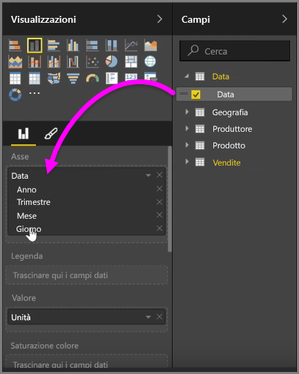
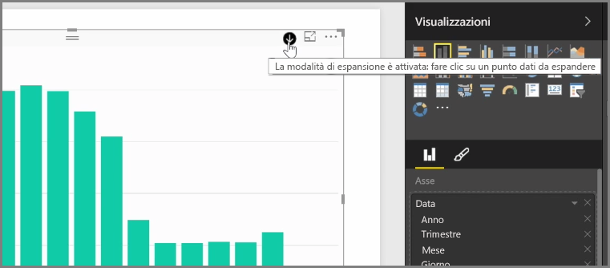
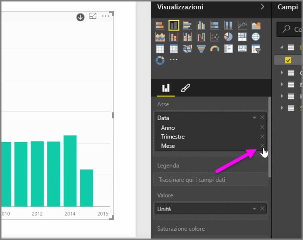
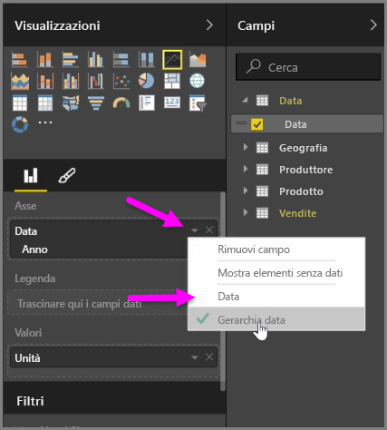
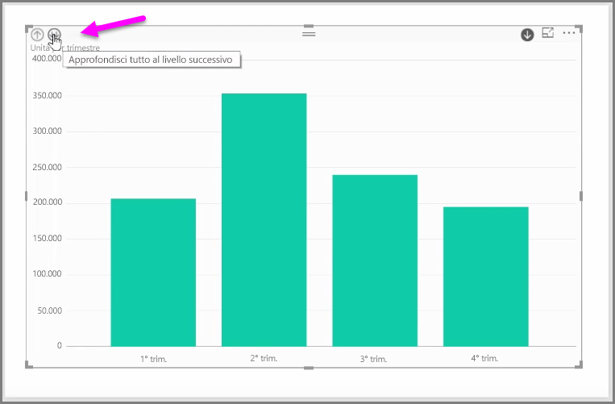

Quando si aggiunge un campo *Data* a un oggetto visivo nel contenitore del campo *Asse*, Power BI aggiunge automaticamente una gerarchia temporale che include *Anno*, *Trimestre*, *Mese* e *Giorno*. In questo modo Power BI consente agli oggetti visivi di disporre di interazioni basate sul tempo con gli utenti che visualizzano i report e agli utenti di eseguire l'esplorazione su diversi livelli di tempo.

Impostando una gerarchia, è possibile iniziare a esplorare la gerarchia temporale. Ad esempio, facendo clic su un anno all'interno grafico è possibile esplorare il livello successivo nella gerarchia, in questo caso i *Trimestri*, che vengono quindi visualizzati nell'oggetto visivo.

All'interno dell'oggetto visivo viene creata in automatico la gerarchia ed è anche possibile gestire il livello di esplorazione del report concesso agli utenti. A tale scopo, nel riquadro Visualizzazioni, fare clic sulla X accanto della gerarchia che si desidera rimuovere. Il livello eliminato viene rimosso dal report e la ricerca non lo visualizza più.

Se è necessario reimpostare il livello nella gerarchia, basta rimuovere il campo *Data* e quindi aggiungerlo nuovamente al riquadro **Campi**. La gerarchia viene ricreata in automatico.

È possibile che alcune volte non si desideri usare la gerarchia per un oggetto visivo. A tale scopo, fare cli sul pulsante freccia giù accanto al campo *Data*, dopo averlo aggiunto a un oggetto visivo, e selezionare **Data** invece di **Gerarchia data**. Questa operazione richiede a Power BI di visualizzare i valori di data non elaborati nell'oggetto visivo.

È anche possibile espandere tutti gli elementi di dati attualmente visibili contemporaneamente, invece di selezionare un unico trimestre o anno. A tale scopo, selezionare l'icona *Drill all* (Espandi tutti) in alto a sinistra dell'oggetto visivo, ovvero un'icona a doppia freccia giù.

