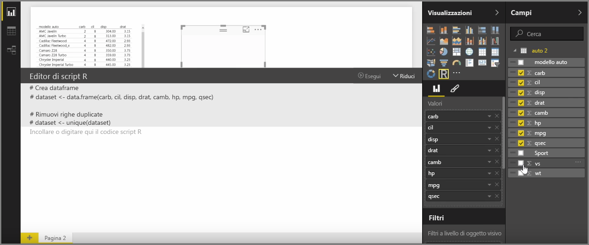
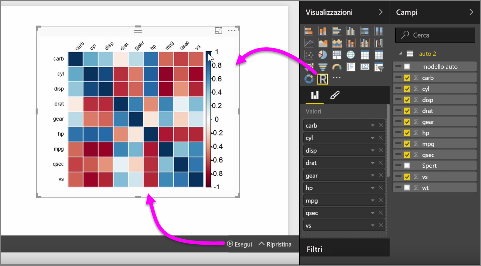
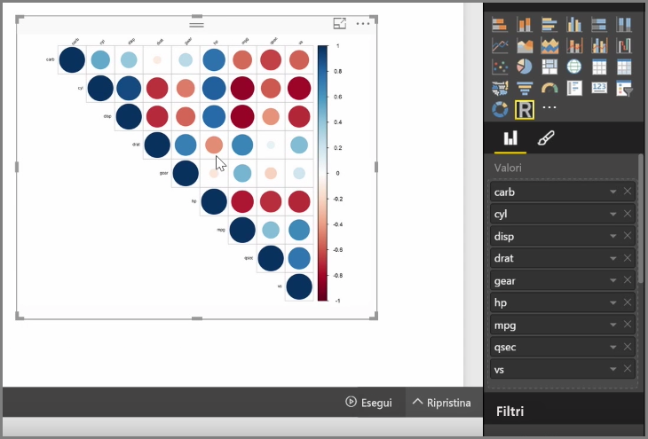
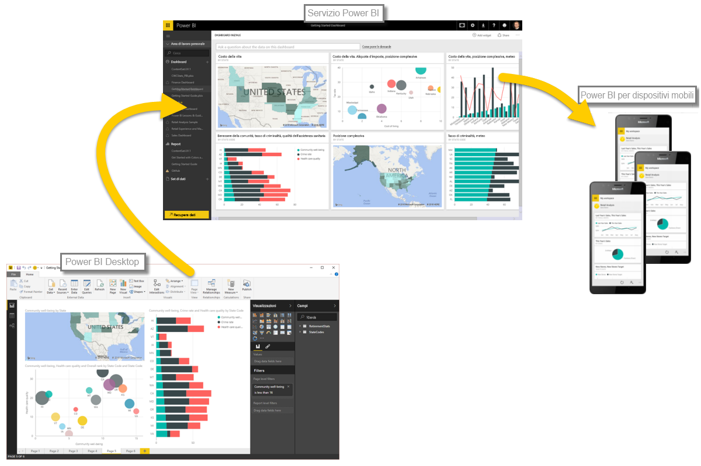

Con Power BI Desktop, è possibile eseguire analisi statistica e analitica e creare oggetti visivi interessanti grazie all'integrazione con R. È possibile eseguire l’hosting di tali visualizzazioni R all'interno del report di Power BI Desktop.

Quando si seleziona l’icona **dell’oggetto visivo R** dal riquadro **Visualizzazioni**, Power BI crea un segnaposto nell'area di disegno per l’hosting dell'oggetto visivo R e quindi presenta un editor di script R destinato all'utilizzo nell'area di disegno. Quando si aggiungono campi all’oggetto visivo R, Power BI Desktop li aggiunge al riquadro dell'editor di script R.

Sotto quanto generato da Power BI nell'editor di script R, è possibile iniziare la creazione di script R per generare l'oggetto visivo. Una volta completato lo script, selezionare **Esegui** e si verifica quanto segue:

1. I dati aggiunti all'oggetto visivo (dal riquadro **Campi**) sono inviati da Power BI Desktop all'installazione locale di R
2. Lo script creato nell'editor di script R di Power BI Desktop viene eseguito in tale installazione locale di R
3. Quindi Power BI Desktop ottiene un oggetto visivo dall’installazione R e lo visualizza nell'area di disegno

Tutto avviene molto rapidamente e il risultato viene visualizzato nella visualizzazione **Oggetto visivo R** nell'area di disegno.

È possibile modificare l'oggetto visivo R modificando lo script R e quindi selezionando nuovamente **Esegui**. Nella figura seguente, è stato modificato l'oggetto visivo per visualizzare cerchi anziché quadrati.

E poiché l’oggetto visivo R è esattamente come qualsiasi altro oggetto visivo in Power BI Desktop, è possibile interagire con esso e stabilire connessioni con altri oggetti visivi nell'area di disegno. Quando si interagisce con altri oggetti visivi nell'area di disegno, tramite il filtro o l'evidenziazione, l’oggetto R automaticamente reagisce esattamente come qualsiasi altro oggetto visivo Power BI, senza la necessità di modificare lo script R.

È un ottimo modo per utilizzare la potenza di R, proprio in Power BI Desktop.

## Passaggi successivi
**Congratulazioni!** Hai completato questa sezione **Visualizzazioni** del corso di **apprendimento guidato** per Power BI. È possibile considerarsi esperti in materia nelle numerose visualizzazioni offerte in Power BI e inoltre esperti su come utilizzarle, modificarle e personalizzarle. E buone notizie: le visualizzazioni sono essenzialmente le medesime in Power BI Desktop e nel servizio Power BI, pertanto l’apprendimento vale per entrambi.

Si è ora pronti per passare al cloud e immergersi nel servizio Power BI, in cui è possibile **Esplorare i dati**. Come si sa, il flusso di lavoro ha un aspetto simile al seguente:

* Importare i dati in **Power BI Desktop** e creare un report.
* Pubblicare nel servizio Power BI, dove è possibile creare nuove **visualizzazioni** e dashboard
* **Condividere** i dashboard con altri utenti, soprattutto con chi è in viaggio
* Visualizzare i dashboard e i report condivisi nelle app **Power BI per dispositivi mobili** e interagire con essi

Se si creano report o solo si visualizzano e interagisce con essi, ora si è appreso come vengono creati tutti questi oggetti visivi interessanti e come avviene la connessione ai dati. Quindi ci occuperemo di vedere tali oggetti visivi e report in azione.

Arrivederci nella prossima sezione.

