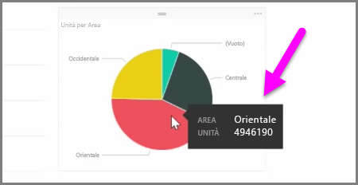

Questo articolo illustra come creare nuovi grafici a barre, grafici a torta e mappe ad albero e personalizzare questi elementi in modo che siano appropriati per i report.

Ci sono due modi diversi per creare una nuova visualizzazione in Power BI Desktop:

* È possibile trascinare i nomi dei campi dal riquadro **Campi** e rilasciarli nell'area di disegno del report. Per impostazione predefinita la visualizzazione è simile a una tabella di dati.
  
  
* È anche possibile fare clic sul tipo di visualizzazione che si vuole creare nel riquadro **Visualizzazioni**. Con questo metodo, l'oggetto visivo predefinito è un segnaposto vuoto simile al tipo di oggetto visivo selezionato.
  
  

Dopo aver creato il grafico, la mappa o il diagramma, è possibile iniziare a trascinare i campi dati nella parte inferiore del riquadro **Visualizzazione** per creare e organizzare l'oggetto visivo. I campi disponibili variano in base al tipo di visualizzazione selezionato. Quando si trascinano e si rilasciano i campi dati, la visualizzazione si aggiorna automaticamente per riflettere le modifiche.

È possibile ridimensionare la visualizzazione selezionandola e quindi trascinando i quadratini di ridimensionamento verso l'interno o l'esterno. È anche possibile spostare la visualizzazione in un punto qualsiasi dell'area di disegno facendo clic e trascinando. Per eseguire la conversione tra tipi diversi di visualizzazioni, selezionare l'oggetto visivo da modificare e quindi selezionare semplicemente un oggetto visivo diverso scegliendo tra le icone del riquadro **Visualizzazione**. Power BI tenta di convertire i campi selezionati nel nuovo tipo di oggetto visivo il più fedelmente possibile.

Quando si passa il puntatore sulle parti delle visualizzazioni, viene visualizzata una descrizione comando con informazioni dettagliate sul segmento, ad esempio etichette e valore totale.

Selezionare l'icona a forma di **pennello** nel riquadro **Visualizzazioni** per apportare ritocchi all'oggetto visivo, ad esempio per quanto riguarda l'allineamento dello sfondo, il testo del titolo e i colori dei dati.

Le opzioni disponibili per tali modifiche all'oggetto visivo variano a seconda del tipo di oggetto visivo selezionato.

