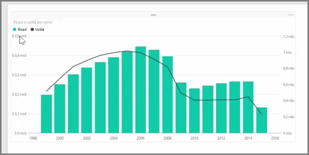
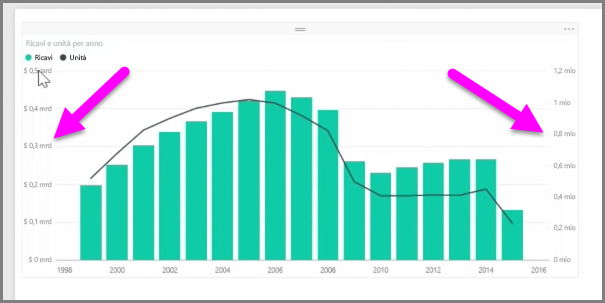
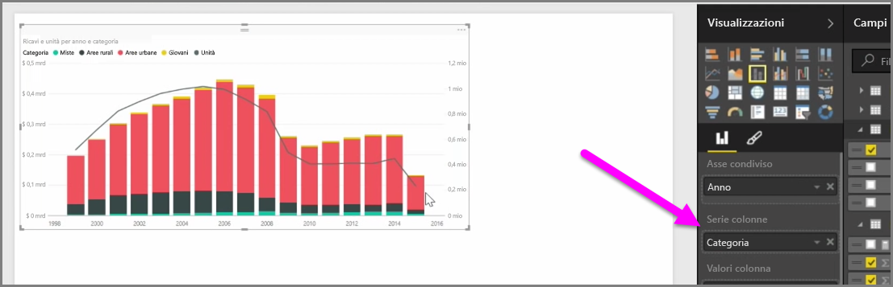

Quando si vuole visualizzare due misure che hanno scale diverse, ad esempio i ricavi e le unità, è molto utile un **grafico combinato**, che mostra una linea e una barra con scale degli assi diverse. Power BI supporta molti tipi diversi di grafici combinati per impostazione predefinita, tra cui i diffusi grafici **Linee** e **Istogramma in pila**.

Quando si crea un grafico combinato, vengono presentati un campo **Asse condiviso** (asse X) e quindi i valori per i due campi, in questo caso una colonna e una linea. Le due legende dell'asse Y appaiono ai due lati della visualizzazione.

È anche possibile suddividere ogni colonna per categoria, trascinando una categoria nel campo Serie di colonne nel riquadro Visualizzazioni. Così facendo, ogni barra viene colorata in modo proporzionale in base ai valori all'interno di ogni categoria.

I grafici combinati sono un efficace strumento per visualizzare più misure con molte scale diverse in un'unica visualizzazione.

