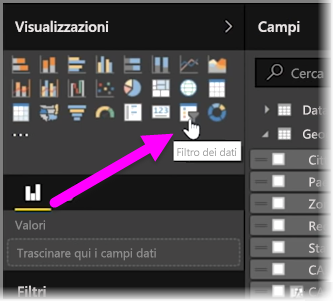
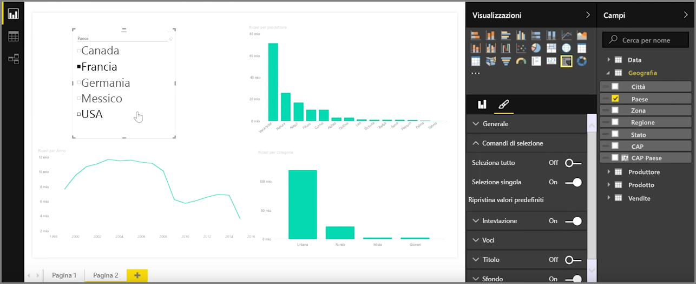
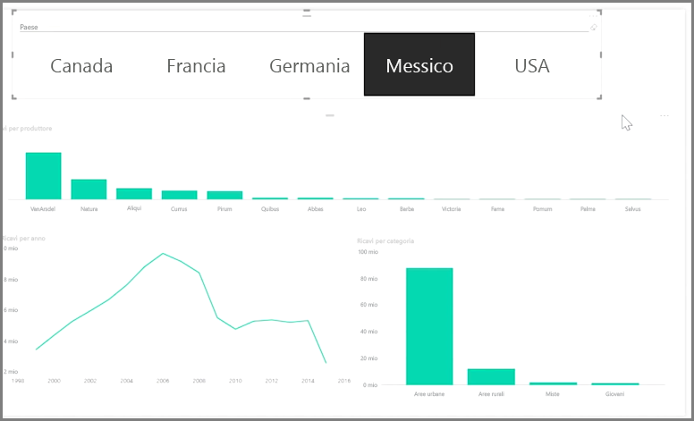

I filtri dei dati sono uno dei tipi di visualizzazioni più potenti, in particolare come parte di un report che contiene molti dati. Un **filtro dei dati** è un filtro visivo sull'area di disegno in **Power BI Desktop** che permette a chiunque osservi un report di segmentare i dati in base a un determinato valore, ad esempio in base all'anno o alla località geografica.

Per aggiungere un filtro dei dati al report, selezionare **Filtro dei dati** nel riquadro **Visualizzazioni**.

Trascinare il campo in base al quale si vuole applicare il filtro dei dati e rilasciarlo sul segnaposto del filtro dei dati. La visualizzazione si trasforma in un elenco di elementi con caselle di controllo. Questi elementi sono i filtri. Selezionare la casella accanto a un elemento da segmentare per filtrare, o *segmentare*, anche tutte le altre visualizzazioni nella stessa pagina del report, in base alla selezione.

Per formattare il filtro dei dati sono disponibili alcune opzioni diverse. È possibile impostarlo per accettare più input contemporaneamente o attivare o disattivare la modalità **Selezione singola** per usarne uno per volta. È anche possibile aggiungere agli elementi del filtro dei dati un'opzione **Seleziona tutto**, utile in presenza di un elenco particolarmente lungo. Modificando l'orientamento del filtro dei dati da quello predefinito verticale a quello orizzontale, la casella di controllo si trasformerà in una barra di selezione.

