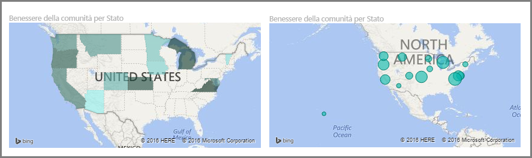
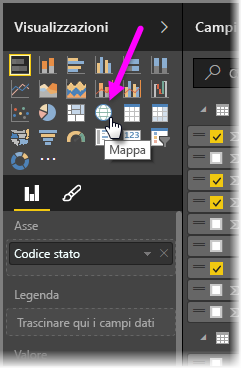
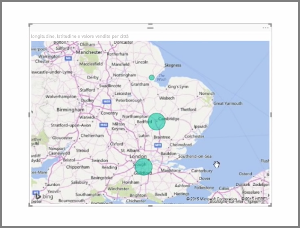
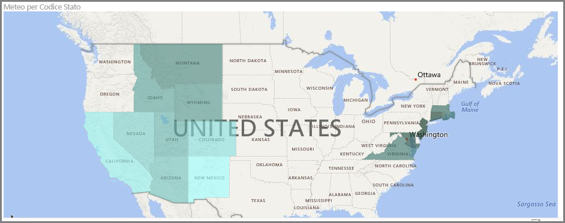
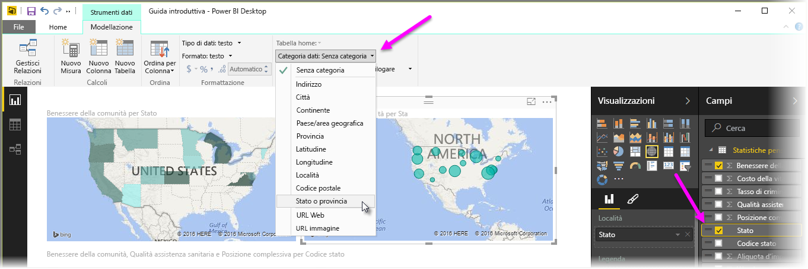

Power BI dispone di due diversi tipi di visualizzazioni della mappa: una mappa a bolle che posiziona una bolla su un punto geografico e una mappa di forme che in realtà illustra la struttura dell'area da visualizzare.

> [!NOTE]
> Quando si lavora con paesi o aree geografiche, usare l'abbreviazione di tre lettere per garantire il corretto funzionamento della geocodifica nelle visualizzazioni delle mappe. *Non* usare le abbreviazioni di due lettere, perché alcuni paesi o aree geografiche potrebbero non essere riconosciuti correttamente.
> Se si hanno a disposizione solo le abbreviazioni a due lettere, vedere questo [post di blog esterno](https://blog.ailon.org/how-to-display-2-letter-country-data-on-a-power-bi-map-85fc738497d6#.yudauacxp) per istruzioni su come associare le abbreviazioni di paese/area geografica di due lettere a quelle di tre lettere.
> 
> 

## Creare mappe a bolle
Per creare una mappa a bolle, selezionare l’opzione **Mappa** nel riquadro **Visualizzazione**. È necessario aggiungere un valore al bucket *Posizione* nelle opzioni **Visualizzazioni** per utilizzare un oggetto visivo della mappa.

Power BI è flessibile sul tipo di valore della posizione accettato, dai dettagli più generali come il nome della città o il codice dell'aeroporto, fino a dati specifici di latitudine e longitudine. Aggiungere un campo al bucket **Dimensioni** per modificare di conseguenza le dimensioni della bolla per ciascuna posizione della mappa.

## Creare mappe delle forme
Per creare una mappa delle forme, selezionare l’opzione **Mappa colorata** nel riquadro Visualizzazione. Come con le mappe a bolle, è necessario aggiungere un tipo di valore per il bucket della località per utilizzare questo oggetto visivo. Aggiungere un campo al bucket Dimensioni per modificare di conseguenza l'intensità del colore di riempimento.

Un'icona di avviso nell'angolo superiore sinistro dell'oggetto visivo indica che la mappa necessita di più dati sulla località per tracciare in modo accurato i valori. Si tratta di un problema comune in particolare quando i dati nel campo del percorso sono ambigui, ad esempio si utilizza un nome di area come *Washington* che potrebbe indicare uno stato o una regione. Un modo per risolvere questo problema consiste nel rinominare la colonna per essere più specifici, ad esempio *Stato*. Un altro modo per risolvere il problema consiste nel reimpostare manualmente la categoria di dati selezionando **Categoria di dati** nella scheda Modellazione. Da qui è possibile assegnare una categoria ai dati, ad esempio "Stato" o "Città".

