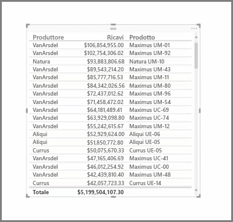
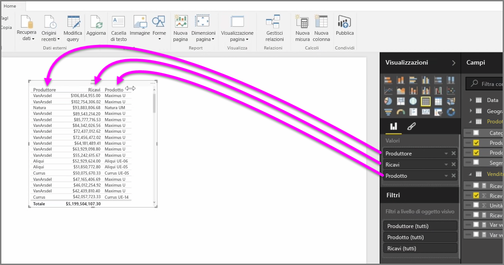
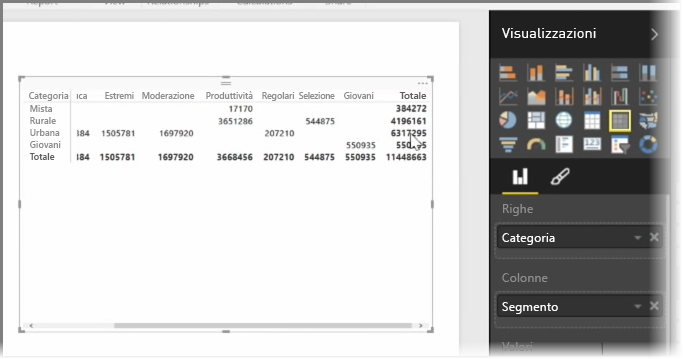

Oltre a moltissimi grafici, Power BI Desktop supporta anche altre visualizzazioni tabulari. Infatti, quando si trascina un campo categorico o un campo di testo nell'area di disegno del report, per impostazione predefinita si ottiene una tabella di risultati. È possibile scorrere verso l'alto e verso il basso la tabella, che inizialmente sarà ordinata alfabeticamente.

Se una tabella contiene informazioni numeriche, ad esempio i ricavi, nella parte inferiore verrà visualizzata una somma totale. È possibile ordinare manualmente ogni colonna facendo clic sull'intestazione per attivare l'ordine crescente o quello decrescente. Se una colonna non è larga abbastanza per visualizzare tutto il contenuto, fare clic e trascinare l'intestazione lateralmente per espanderla.

L'ordine dei campi nel bucket *Valori* nel riquadro **Visualizzazioni** determina l'ordine in cui vengono visualizzati nella tabella.

Una **matrice** è simile a una tabella, ma ha intestazioni di categoria diverse nelle colonne e nelle righe. Come per le tabelle, nella parte inferiore e nel lato destro della matrice viene automaticamente calcolato il totale delle informazioni numeriche.

Per le matrici sono disponibili molte opzioni di layout, come il ridimensionamento automatico delle colonne, l'attivazione o disattivazione dei totali di riga e di colonna, l'impostazione dei colori e altro ancora. Quando si crea una matrice, assicurarsi che i dati categorici (i dati non numerici) siano visualizzati a sinistra della matrice, e che i file numerici siano visualizzati a destra per garantire che la barra di scorrimento orizzontale sia visualizzata e per assicurarsi che lo scorrimento funzioni correttamente.

