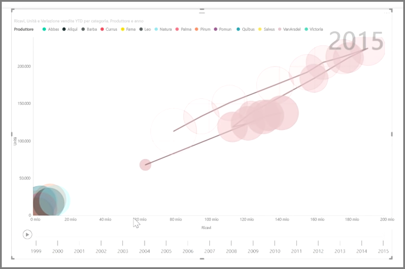

Se si desidera confrontare due misure diverse, ad esempio vendite unitarie e ricavi, la visualizzazione comune da usare è il grafico a dispersione.

Per creare un grafico vuoto, selezionare **Grafico a dispersione** nel riquadro **Visualizzazioni**. Trascinare e rilasciare i due campi che si desidera confrontare dal riquadro **Campi** sui contenitori delle opzioni *Asse X* e *Asse Y*. A questo punto, il grafico a dispersione viene probabilmente visualizzato solo come una piccola bolla al centro dell'oggetto visivo. È necessario aggiungere una misura nel contenitore *Dettagli* per indicare come si desidera segmentare i dati. Ad esempio, se il confronto verte su vendite e ricavi di un articolo, si potrebbe desiderare di suddividere i dati in base alla categoria, al produttore o al mese di vendita.

L'aggiunta di un campo extra al contenitore *Legenda* assegna una codifica del colore alla bolla in base al valore del campo. È possibile anche aggiungere un campo al contenitore *Dimensioni* per modificare le dimensioni delle bolle in base a tale valore.

I grafici a dispersione offrono numerose opzioni di formattazione visiva, quali l'evidenziazione di ogni bolla colorata e l'attivazione/disattivazione di singole etichette. È possibile modificare i colori dei dati anche su altri tipi di grafico.

Nel tempo è possibile creare un'animazione delle modifiche del grafico a bolle aggiungendo un campo basato sul tempo al contenitore *Asse di riproduzione*. Fare clic su una bolla durante l'animazione per visualizzare una traccia del percorso.

>[!NOTE]
>Tenere presente che se è visualizzata solo una bolla nel grafico a dispersione, significa che Power BI sta aggregando i dati, come comportamento predefinito. Aggiungere una categoria al contenitore *Dettagli* nel riquadro **Visualizzazioni** per ottenere più bolle.
> 
> 

