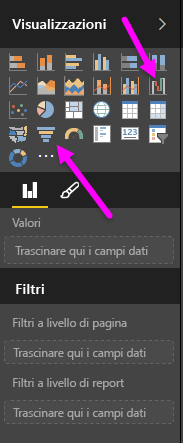
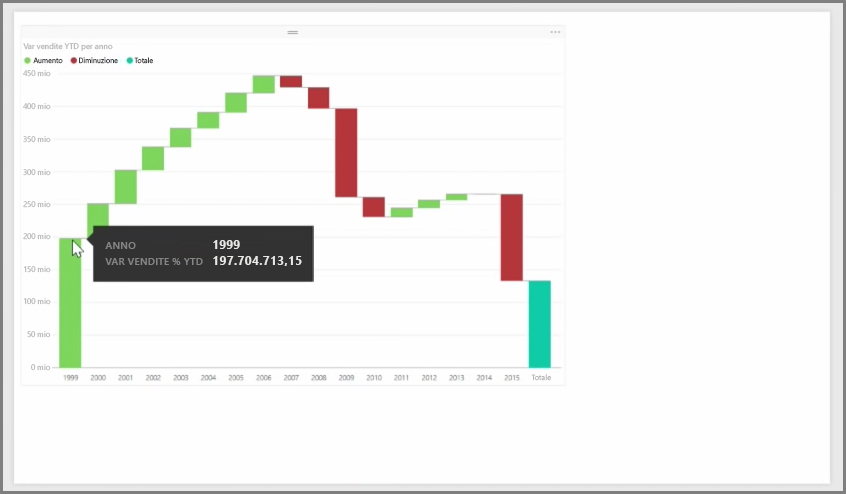
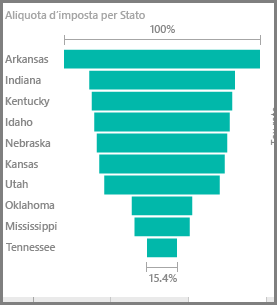

I grafici a imbuto e a cascata sono due delle visualizzazioni standard più interessanti (e probabilmente non comuni) incluse in Power BI. Per creare un grafico vuoto di entrambi i tipi, selezionare l'icona dal riquadro **Visualizzazioni**.

**I grafici a cascata** vengono in genere utilizzati per visualizzare le modifiche in un determinato valore nel tempo.

I grafici a cascata dispongono di due opzioni bucket: *Categoria* e *Asse Y*. Trascinare un campo basato sul tempo, ad esempio *anno* nel bucket *Categoria* e il valore di cui tenere traccia per il bucket *Asse Y*. I periodi di tempo in cui si è verificato un aumento del valore vengono visualizzati in verde per impostazione predefinita, mentre i periodi con una riduzione del valore vengono visualizzati in rosso.

**I grafici a imbuto** vengono in genere utilizzati per visualizzare le modifiche in un determinato processo, ad esempio una pipeline di vendita o i tentativi di conservazione di un sito Web.

I grafici a **cascata** e **a imbuto** possono essere sezionati e personalizzati visivamente.

