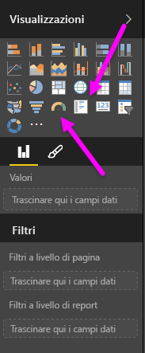
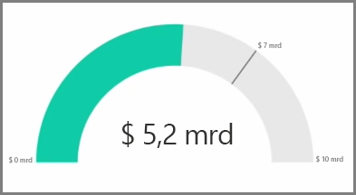
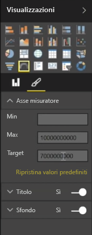
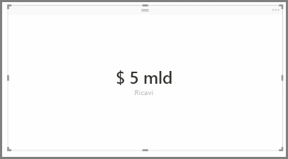
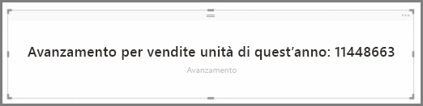

Le visualizzazioni vengono in genere usate per confrontare due o più valori diversi. Quando si creano report, tuttavia, a volte può essere necessario tenere traccia di un unico indicatore di prestazioni chiave o metrica nel tempo. A questo scopo, in Power BI Desktop è possibile usare un oggetto visivo **misuratore** o scheda con **numero singolo**. Per creare un grafico vuoto di entrambi i tipi, selezionarne l'icona nel riquadro **Visualizzazioni**.

I misuratori sono particolarmente utili quando si creano dashboard e si vuole mostrare l'avanzamento verso un determinato obiettivo. Per creare un misuratore, selezionarne l'icona nel riquadro **Visualizzazioni** e trascinare il campo di cui si vuole tenere traccia nel bucket *Valore*.

I misuratori sono visualizzati al 50% per impostazione predefinita oppure a dimensione doppia rispetto a quanto specificato in *Valore* ed esistono due modi per modificare questa impostazione. Per impostare dinamicamente i valori, trascinare i campi nei bucket dei valori *Minimo*, *Massimo* e *Target*. In alternativa, usare le opzioni di formattazione visive per personalizzare manualmente l'intervallo del misuratore.

Le visualizzazioni a scheda mostrano semplicemente una rappresentazione numerica di un campo. Per impostazione predefinita, gli oggetti visivi scheda usano unità visualizzate per mantenere breve il numero, ad esempio visualizzando "€ 5 mld" invece di "€ 5.000.000.000". Usare le opzioni di formattazione visive per modificare l'unità usata o per disabilitarla completamente.

Un'interessante applicazione delle schede consiste nell'usarle per visualizzare una misura personalizzata concatenata con testo. Per usare l'esempio precedente, con una misura personalizzata la scheda potrebbe includere funzioni DAX avanzate e visualizzare, ad esempio, "Totale ricavi di quest'anno: € 5 mld" o "Avanzamento nella vendita di unità quest'anno:" seguito dal numero che rappresenta l'avanzamento.

