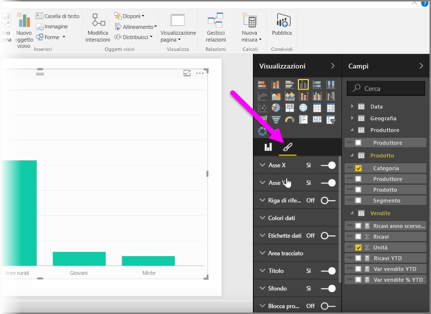
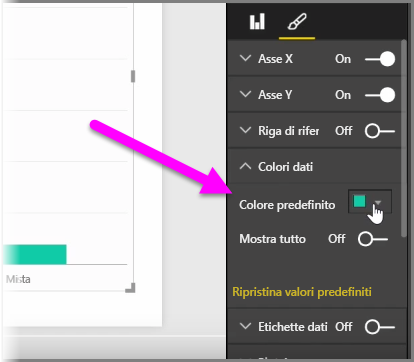
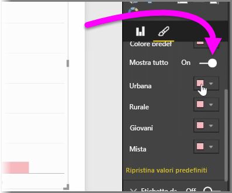
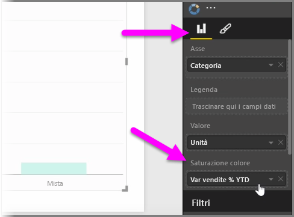
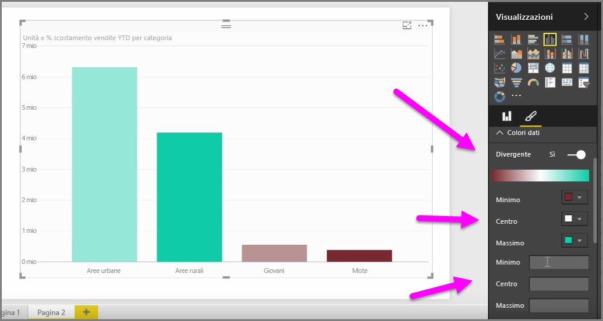
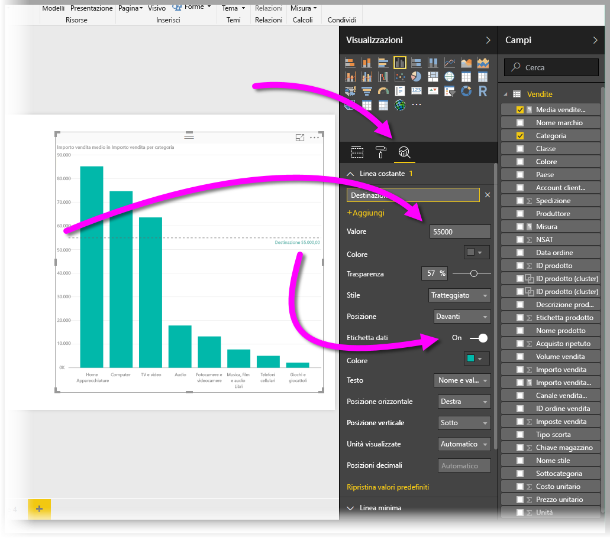
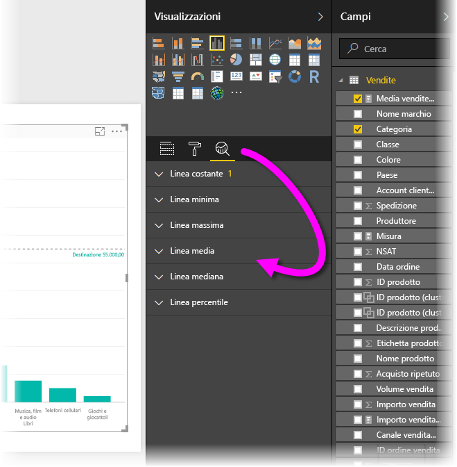

In molti casi si potrebbe voler modificare i colori usati in grafici o oggetti visivi. Power BI offre un elevato livello di controllo sulla visualizzazione dei colori. Per iniziare, selezionare un oggetto visivo e quindi fare clic sull'icona del **pennello** nel riquadro **Visualizzazioni**.

Sono disponibili molte opzioni per modificare i colori o la formattazione dell'oggetto visivo. È possibile modificare il colore di tutte le barre di un oggetto visivo facendo clic sulla selezione colori accanto a **Colore predefinito** e quindi selezionando il colore preferito.

È anche possibile modificare il colore di ogni barra (o di un altro elemento, a seconda del tipo di oggetto visivo selezionato) attivando il dispositivo di scorrimento **Mostra tutto**. In questo modo, viene visualizzato un selettore del colore per ogni elemento.

È anche possibile modificare il colore in base a un valore, o misura. A questo scopo, trascinare un campo nel bucket **Saturazione colore** nel riquadro Visualizzazioni, disponibile nel **contenitore di campi** e non nella sezione dei **pennelli**.

Inoltre, è possibile modificare la scala e i colori usati per il riempimento dei colori degli elementi dati. È anche possibile selezionare una scala divergente attivando il dispositivo di scorrimento Divergente, che permette al colore di usare una scala tra tre colori diversi. È anche possibile impostare i valori *Minimo*, *Al centro* e *Massimo* visualizzati nel grafico.

È possibile usare questi valori per creare regole, ad esempio, in modo da impostare valori maggiori di zero per un determinato colore e valori minori per un altro colore.

Un altro strumento utile per l'uso dei colori è l'impostazione di una *linea costante*, talvolta anche detta *linea di riferimento*. È possibile specificare il valore della linea costante, impostarne il colore e addirittura fare in modo che contenga un'etichetta. Per creare una linea costante (e altre linee interessanti), selezionare il **riquadro Analisi** (la lente di ingrandimento), quindi espandere la sezione **Linea di riferimento**.

È possibile creare molte altre linee per un oggetto visivo, anch'esse disponibili nel **riquadro Analisi**, ad esempio le linee Min, Max, Media, Mediana e Percentile.

Infine, è possibile creare un bordo attorno a una singola visualizzazione e, come per gli altri controlli, specificare anche il colore del bordo.

