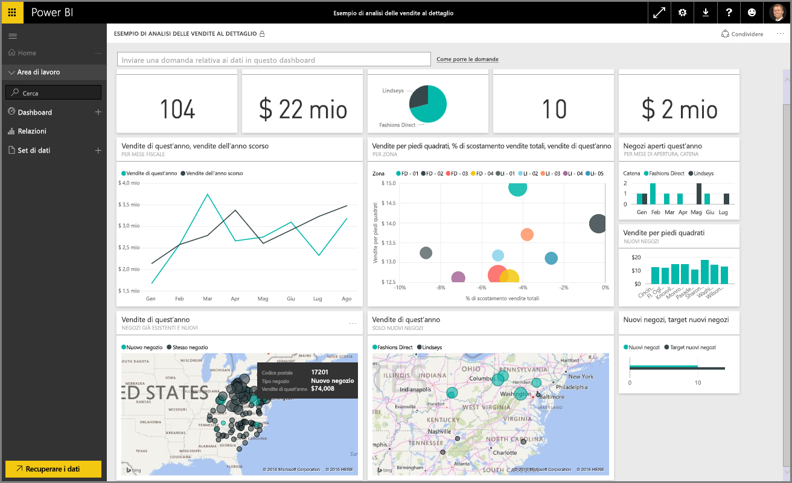

Questa è la sezione relativa all'**esplorazione dei dati** del corso di **apprendimento guidato** per Power BI. Ora che si ha familiarità con Power BI Desktop e si è appreso come ottenere e visualizzare dati, è possibile esplorare i dati nel servizio Power BI.

In questa sezione si apprenderanno molti aspetti e verranno messe in notevole evidenza le accattivanti caratteristiche di interattività e condivisione di Power BI. Di conseguenza, si tratta di una sezione molto coinvolgente e interessante.

## Introduzione al servizio Power BI
*Tutti i vantaggi del servizio Power BI per un'organizzazione*

Il servizio Power BI è l'estensione naturale di **Power BI Desktop** e tra le sue funzionalità include il caricamento di report, la creazione di dashboard e la possibilità di porre domande sui dati usando il linguaggio naturale. È possibile usare il servizio per impostare i tempi di aggiornamento dei dati, condividere dati con l'organizzazione e creare Service Pack personalizzati.

Negli argomenti seguenti verrà descritto il servizio Power BI e verrà illustrato come tale servizio può trasformare i dati di business intelligence in analisi approfondite dei dati e offrire un ambiente di collaborazione che semplifica le decisioni da adottare.

