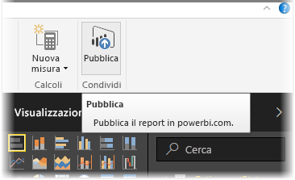
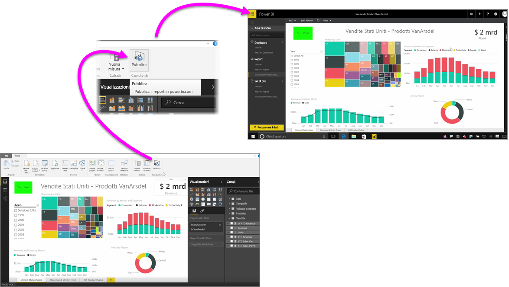

La pubblicazione dei report nel servizio Power BI è un'operazione rapida e semplice.

Dopo aver completato la creazione del report in **Power BI Desktop**, è sufficiente selezionare il pulsante **Pubblica** nella scheda **Home** in Power BI Desktop per avviare il processo.

Il report e i dati, incluse le visualizzazioni, le query e le misure personalizzate, vengono riuniti insieme e caricati nel servizio Power BI.

> [!NOTE]
> I report di Power BI Desktop vengono comunemente chiamati file **PBIX**, che corrisponde all'estensione assegnata loro in Windows.
> 

Al termine del caricamento, una finestra di dialogo indica che il processo di pubblicazione è stato completato e contiene un collegamento che reindirizza direttamente al report nel servizio Power BI, in un Web browser.

Ecco fatto. Pubblicare report da Power BI Desktop al servizio Power BI è un gioco da ragazzi.

