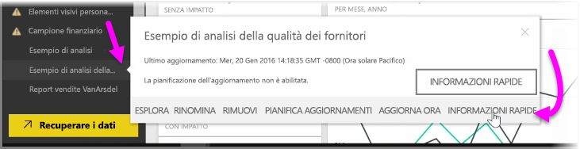
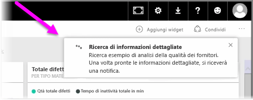
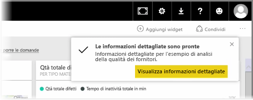
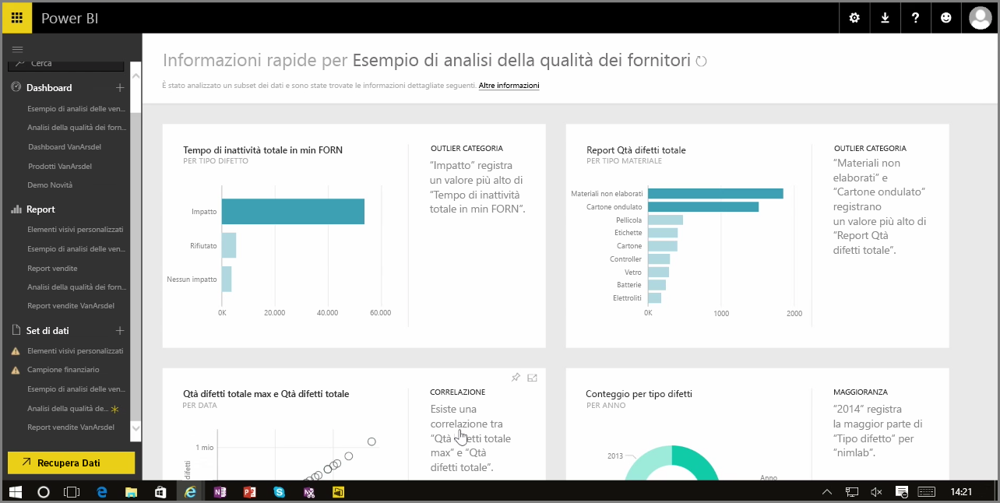

Quando si lavora con un dashboard, report o set di dati nel servizio Power BI, è possibile configurare Power BI per la ricerca di Informazioni rapide nei dati. In Power BI dalla sezione **Set di dati** nel riquadro a sinistra selezionare i *puntini di sospensione* (tre punti) accanto al set di dati d'interesse. Vengono visualizzate le opzioni del menu e, sull'estrema destra, appare l'opzione **Informazioni rapide**.

Quando si seleziona Informazioni rapide, Power BI esegue alcune operazioni di Machine Learning e ricerche nei dati, analizzandoli per trovare informazioni rapide. Verrà visualizzata una notifica nella parte superiore destra del servizio che indica che Power BI sta cercando le informazioni.

Dopo circa 15 secondi, la notifica cambia informando che Power BI ha trovato alcune informazioni.

Selezionando il pulsante **Visualizza informazioni dettagliate** nella notifica, viene presentata una pagina di oggetti visivi che mostrano le informazioni dettagliate trovate da Power BI, analogamente a quanto mostrato nell'immagine seguente. Esistono una serie di informazioni dettagliate: scorrere verso il basso nella pagina per visualizzarle e consultarle.

Come per qualsiasi altro oggetti visivo, è possibile interagire con gli oggetti visivi nella pagina di Informazioni rapide ed è anche possibile aggiungere gli oggetti a un dashboard o filtrare uno o più oggetti (o il numero desiderato) per cercare informazioni aggiuntive che potrebbero essere d'interesse per l'utente.

Con **Informazioni rapide** si consente a Power BI di eseguire il lavoro di individuazione di outlier e tendenze nei dati, per poi usare questi risultati nei dashboard o per perfezionarli e filtrarli al fine di ottenere le informazioni più importanti per l'utente.

