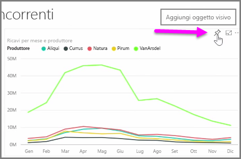
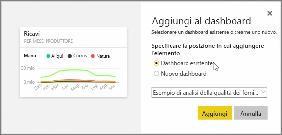
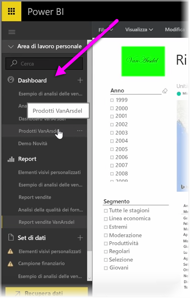
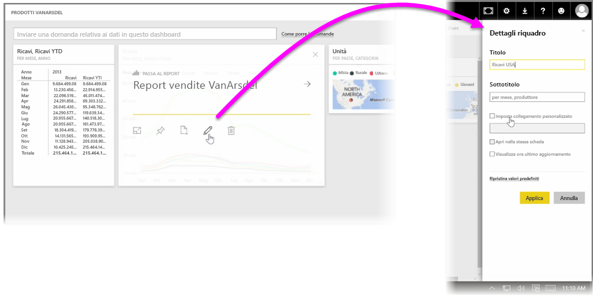

I **dashboard** in Power BI sono raccolte di visualizzazioni di una pagina che vengono create all'interno del servizio Power BI. I dashboard vengono creati **aggiungendo** visualizzazioni dei report creati e pubblicati tramite Power BI Desktop o visualizzazioni create all'interno dello stesso servizio Power BI. **Aggiungere** un oggetto visivo in un dashboard è come aggiungere un'immagine da una lavagnetta su una parete: l'oggetto visivo viene fissato in un punto particolare perché venga visto da tutti gli utenti. Per aggiungere un oggetto visivo, aprire il report nel servizio Power BI. Passare il puntatore del mouse sull'oggetto visivo da aggiungere, quindi selezionare l'icona della **puntina**.

Viene visualizzata una finestra di dialogo, in cui si seleziona un dashboard di destinazione per l'oggetto visivo dal menu a discesa oppure è possibile creare un nuovo dashboard. È anche possibile visualizzare un'anteprima dell'oggetto visivo aggiunto al dashboard. È possibile aggiungere visualizzazioni da più report e pagine a un singolo dashboard, con la possibilità di combinare diversi set e origini di dati in un'unica pagina di informazioni.

In **Dashboard** è possibile aggiungere qualsiasi tipo di visualizzazione tra cui grafici, mappe, immagini e forme, semplicemente "aggiungendoli". Dopo aver aggiunto un oggetto visivo a un dashboard, questo prende il nome di **riquadro**.

I dashboard, inclusi quelli nuovi, vengono visualizzati nella sezione Dashboard sul lato sinistro del servizio Power BI. Selezionare un dashboard nell'elenco per visualizzarlo.

È possibile modificare il layout degli oggetti visivi in un dashboard secondo le proprie esigenze. Per ridimensionare un riquadro, trascinare i contorni verso l'interno o verso l'esterno. Per spostare un riquadro, fare clic e trascinarlo in una posizione diversa nel dashboard. Passare il mouse su un riquadro e fare clic sull'icona della **matita** per aprire **Dettagli riquadro**, in cui è possibile modificare **Titolo** o **Sottotitolo**.

Fare clic su un riquadro del dashboard per visualizzare il report da cui è stato generato. Ciò consente di visualizzare rapidamente i dati sottostanti un oggetto visivo. È anche possibile modificare tale collegamento usando il campo **Imposta collegamento personalizzato** in **Dettagli riquadro**.

È possibile aggiungere riquadri tra i dashboard, ad esempio quando si dispone di un insieme di dashboard e si desidera creare una scheda di riepilogo. La procedura è uguale: passare il mouse sul riquadro e selezionare l'**icona della puntina**. I dashboard sono facili da creare e modificare. Ed è possibile personalizzarli in modo da visualizzare il dashboard su una pagina, che mostra esattamente quello che l'utente desidera.

