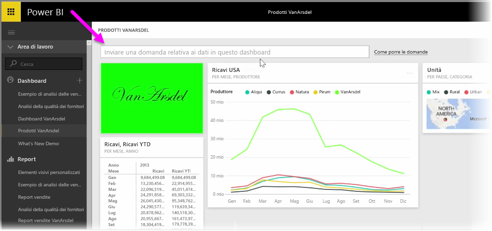
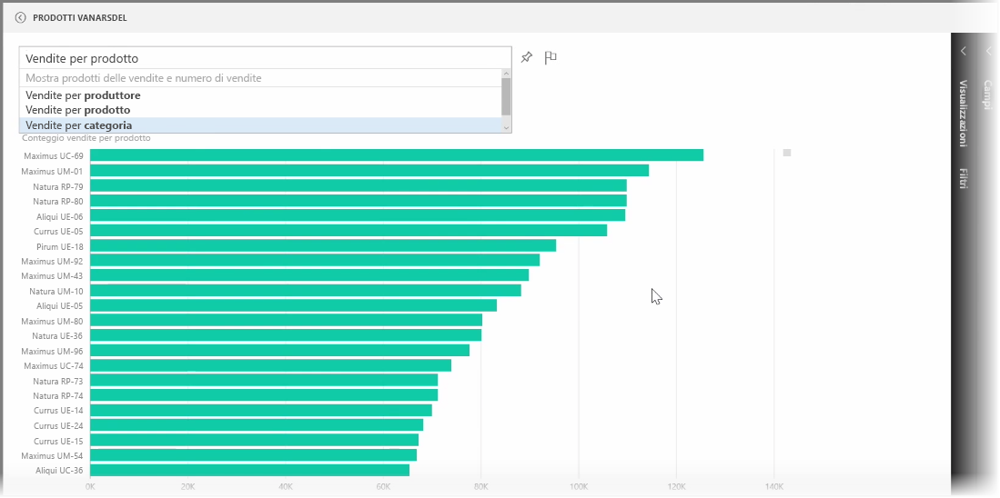
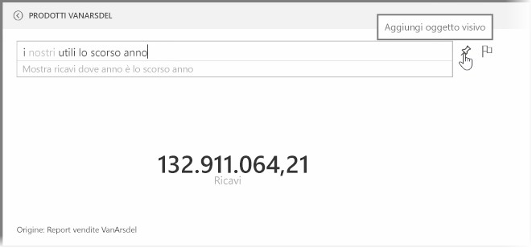
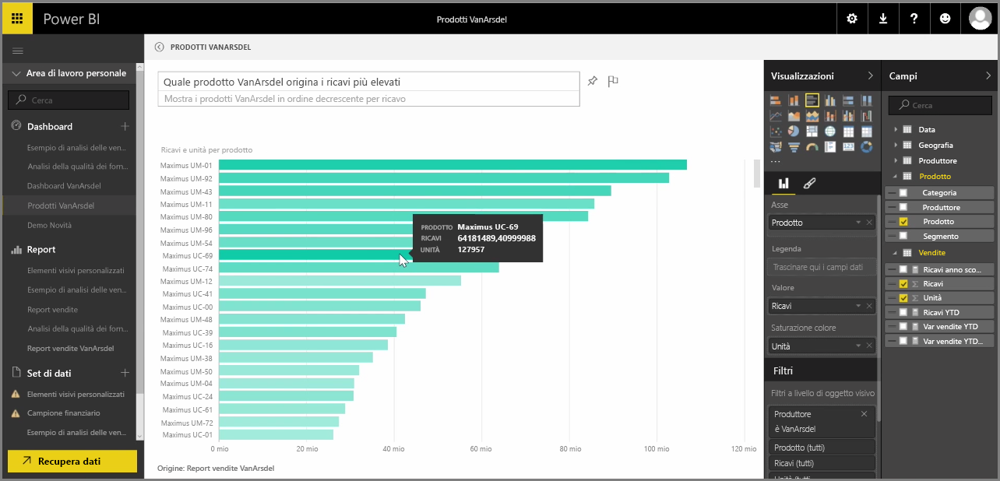

Power BI include un potente motore di riconoscimento della lingua che permette di porre domande sui dati con frasi e domande colloquiali. Di conseguenza, oltre a creare report e visualizzazioni con Power BI, è possibile creare anche diagrammi e grafici ponendo semplici domande.

Per porre una domanda sui dati, aprire un dashboard in Power BI perché nella parte superiore dello schermo venga visualizzata una casella di input, in cui è possibile rivolgere domande sui dati visualizzati. Questa funzionalità si chiama *Domande* **e risposte**.

Quando si fa clic nella casella, Power BI visualizza prompt con alcuni termini suggeriti in base ai dati, ad esempio "ricavi da inizio anno". È possibile fare clic su un termine suggerito per visualizzare il risultato, spesso come semplice tabella o scheda. Quando si seleziona una delle frasi suggerite, Power BI crea automaticamente e in tempo reale un oggetto visivo in base alla selezione.

È anche possibile porre domande usando il linguaggio naturale, ad esempio "Quali sono stati i nostri ricavi l'anno scorso?" oppure "Qual è stato il prodotto più venduto nel marzo 2014?". Power BI visualizza l'interpretazione della domanda e sceglie il tipo migliore di oggetto visivo per rappresentare la risposta. Proprio come per qualsiasi altro oggetto visivo in Power BI, inoltre, questo può essere **aggiunto** al dashboard preferito selezionando l'icona **aggiungi**.

In qualsiasi momento è possibile modificare l'oggetto visivo creato dalla domanda o dalla frase in linguaggio naturale. È sufficiente usare i riquadri **Visualizzazioni** e **Campi** sul lato destro dello schermo. Come per qualsiasi altro elemento visivo in Power BI, è possibile modificare il layout, i filtri e gli input dei campi.

Per salvare la visualizzazione in un dashboard dopo aver creato l'oggetto visivo perfetto, è sufficiente selezionare l'icona **aggiungi** accanto alla casella di input delle domande.

