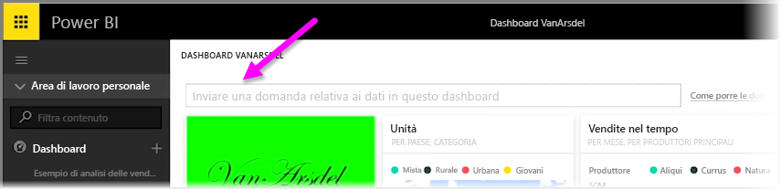
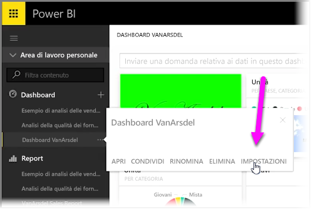
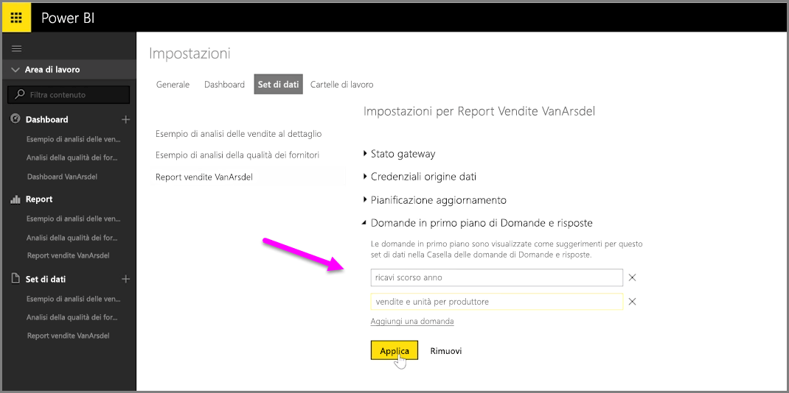

Con Power BI, è possibile aggiungere le proprie domande suggerite per altri utenti che usano la casella di query di un dashboard in linguaggio naturale, spesso denominata casella **Domande e risposte**. Le domande suggerite verranno visualizzate dagli utenti quando fanno clic sulla casella di input nella parte superiore del dashboard.

Per aggiungere le proprie domande, selezionare i puntini di sospensione (tre punti...) accanto al nome del dashboard che si desidera usare e quindi selezionare **Impostazioni** dal menu.

 Verrà visualizzata la pagina **Impostazioni** per il dashboard e i set di dati o le cartelle di lavoro sottostanti. È possibile disabilitare la casella di input per la ricerca di Domande e risposte dalla sezione **Dashboard** della pagina **Impostazioni**. Nel caso in cui si vogliano aggiungere domande, selezionare la sezione **Set di dati**.

Nella sezione **Set di dati** vengono visualizzati tutti i set di dati associati al dashboard. Selezionare il set di dati associato al dashboard dell'elenco, selezionare **Domande in primo piano di Domande e risposte**, quindi selezionare il collegamento **Aggiungi una domanda**. Immettere la domanda o il prompt dei comandi nella casella di input e selezionare **Applica**.

Ora ogni volta che si fa clic sulla casella di input per la ricerca nel dashboard selezionato, verranno visualizzate le voci suggerite nella parte superiore dell'elenco dei prompt. La selezione della domanda indirizza direttamente alla relativa risposta di Domande e risposte. Questo è un modo utile per far riflettere gli utenti del dashboard sul tipo di dati disponibili e su come sfruttarli al meglio.

