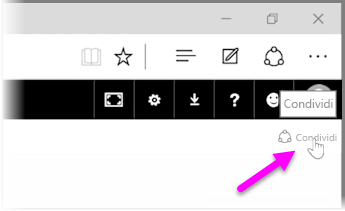
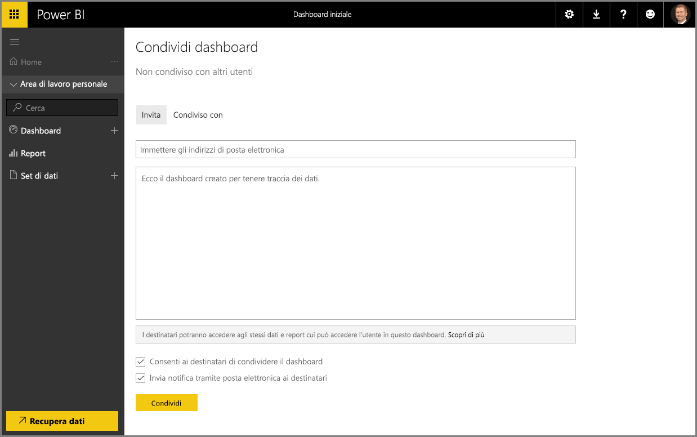

Abbiamo già visto come Power BI consenta di trovare i dati, raccoglierli in un modello di dati e compilare report e visualizzazioni sull'uso degli stessi. Abbiamo visto anche in che modo è possibile pubblicare i report sul servizio Power BI e creare dashboard che consentono di monitorare le informazioni nel tempo. Tutte queste funzionalità risultano ancora più efficaci quando si condividono le informazioni con altri utenti nell'organizzazione. Fortunatamente, è facile condividere i dashboard.

Per condividere un dashboard, aprirlo nel servizio Power BI e selezionare il collegamento **Condividi** in alto a destra.

Viene visualizzata la pagina **Condividi dashboard** in cui è possibile selezionare la sezione **Invita**, quindi compilare la casella di testo dell'**Indirizzo di posta elettronica** inserendo l'indirizzo delle persone a cui si desidera concedere l'accesso al dashboard. Power BI confronta gli indirizzi di posta elettronica durante la digitazione con gli account del proprio dominio e del dominio di Office 365 e, se possibile, esegue il completamento automatico. È anche possibile copiare e incollare gli indirizzi di posta elettronica nella casella oppure usare un elenco di distribuzione, un gruppo di protezione o un gruppo di Office 365 per raggiungere più persone contemporaneamente.

Se si seleziona la casella di controllo *Invia notifica tramite posta elettronica ai destinatari* nella parte inferiore, i destinatari riceveranno un messaggio di posta elettronica per informarli che un utente ha condiviso con loro un dashboard. Il messaggio contiene il collegamento al dashboard. È possibile aggiungere una nota al messaggio di posta elettronica o inviare la nota creata da Power BI, che si trova nella casella in basso al campo per l'immissione degli indirizzi di posta elettronica.

>[!NOTE]
>I destinatari che non hanno un account Power BI esistente verranno indirizzati nelle procedura di registrazione prima di poter visualizzare il dashboard.
> 
> 

Tutti gli utenti con cui si condivide un dashboard possono vedere e interagire con esso, esattamente come il creatore. Tuttavia, dispongono di accesso in *sola lettura* ai report sottostanti e *non dispongono di accesso* ai set di dati sottostanti.

È anche possibile selezionare la scheda **Condiviso con** della pagina Condividi dashboard per visualizzare gli utenti con cui si è condiviso questo dashboard in precedenza.

