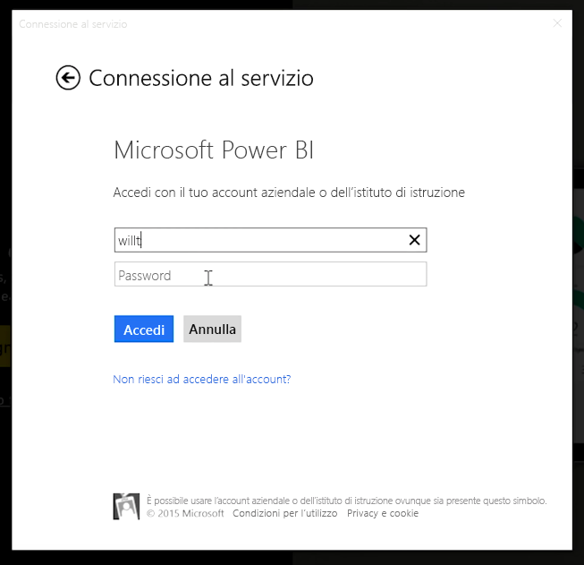
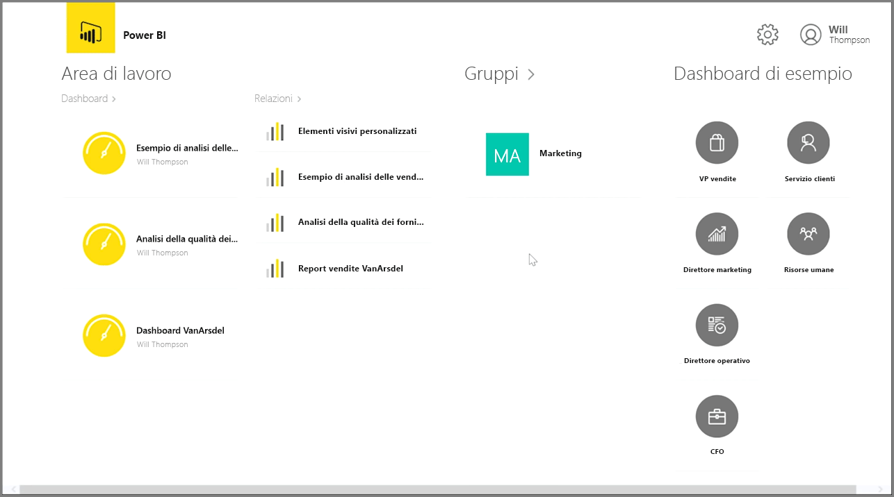
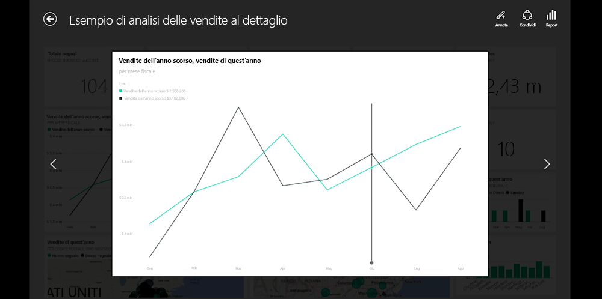
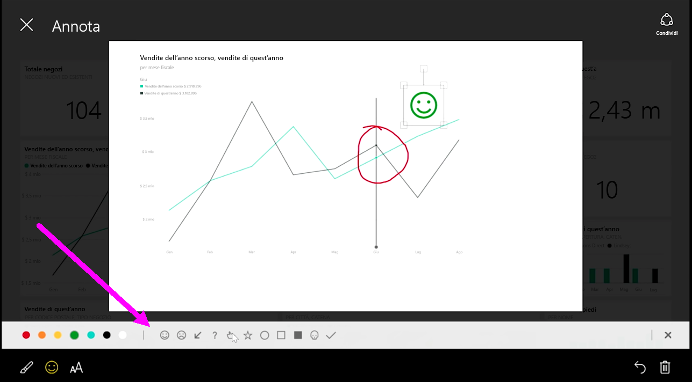

Per tenere traccia dei dati mentre si è in viaggio, è possibile usare una delle applicazioni Power BI per dispositivi mobili per dispositivi iOS, Android e Windows.

Quando si usa l'app Power BI, accedere prima all'account usando le informazioni account del servizio Power BI. In un dispositivo mobile Windows (in questo caso un tablet), l'accesso ha un aspetto simile al seguente.

La prima schermata visualizzata contiene tutto il contenuto a cui si ha accesso, inclusi i report, i dashboard e i gruppi. Sono disponibili anche i dashboard di esempio che è possibile utilizzare come punto di partenza o semplicemente per visualizzare le funzionalità di Power BI. L'applicazione è touch-friendly: toccare un dashboard o report per visualizzarlo a schermo intero e scorrerli con il dito.

È possibile aprire i dashboard toccandoli. All'interno di un dashboard, è possibile toccare su un riquadro del dashboard per concentrarsi su di esso in una visualizzazione più grande.

È inoltre possibile annotare informazioni dettagliate scoperte toccando il pulsante **Annota**, nell'angolo superiore destro. Ciò consente di disegnare su un riquadro con stato attivo per evidenziare aree specifiche di interesse. Gli strumenti di annotazione sono disponibili nella parte inferiore della schermata.

Condividere il riquadro con annotazioni toccando il collegamento **Condividi** in alto a destra.

Toccare il collegamento **Report** nell'angolo superiore destro per visualizzare il report sottostante di un riquadro. Verranno visualizzate esattamente le stesse visualizzazioni che sarebbero visualizzate in un browser web o in Power BI Desktop e includere anche la possibilità di interagire con il report toccando sulle barre, eseguendo il drill-down o utilizzando i filtri dei dati.

