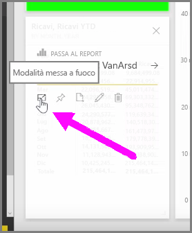
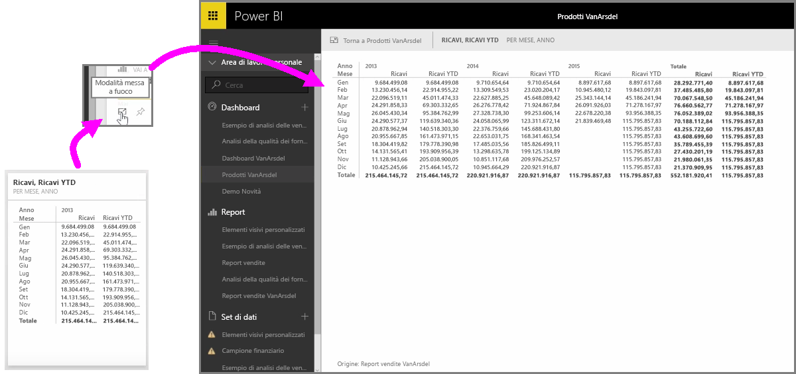

Quando si esaminano i dashboard di Power BI o i report del servizio, può a volte essere utile concentrarsi su un singolo grafico o su una sola visualizzazione. È possibile eseguire questa operazione in due modi diversi.

Nel dashboard passare il mouse su un riquadro per visualizzare diverse opzioni a icona nell'angolo superiore a destra. Quando si selezionano i puntini di sospensione (tre punti) viene visualizzata una raccolta di icone che rappresentano azioni da eseguire sul riquadro.

L'icona più a sinistra presenta l'etichetta **Modalità messa a fuoco**. Selezionare l'icona per espandere il riquadro e includere tutto il dashboard.

La **Modalità messa a fuoco** consente di visualizzare altri dettagli su oggetti visivi e legende. Ad esempio, quando si ridimensiona un riquadro in Power BI, alcune colonne potrebbero non essere visualizzate a causa dello spazio disponibile nel riquadro.

Nella **Modalità messa a fuoco** è possibile visualizzare tutti i dati. È anche possibile aggiungere l'oggetto visivo direttamente dalla Modalità messa a fuoco a un dashboard diverso selezionando l'icona della **puntina**. Per uscire dalla **Modalità messa a fuoco**, selezionare l'icona **Torna a ...** nell'angolo superiore sinistro della **Modalità messa a fuoco**.

Quando si visualizza un report, la procedura è analoga. Passare il mouse su un oggetto visivo per visualizzare le tre icone nell'angolo superiore destro e selezionare l'icona **Modalità messa a fuoco**. Selezionando questa icona si espande la visualizzazione per includere l'intera area di disegno del report. L'oggetto visivo è ancora interattivo in questa modalità, anche se si perde temporaneamente qualsiasi effetto di filtro incrociato tra le visualizzazioni.

Passare il mouse su un riquadro o report espanso e selezionare l'icona **Torna a ...** nell'angolo superiore sinistro per tornare alla visualizzazione precedente.

