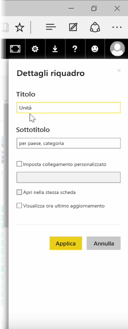

Dopo aver creato un dashboard, è possibile modificare i relativi **Riquadri* nel servizio Power BI per apportare modifiche alla formattazione.

Per apportare modifiche a un riquadro, selezionare i puntini di sospensione (tre punti) per visualizzare un insieme di icone che consentono di apportare modifiche al riquadro.

Selezionare l'icona **Apri** per aprire il riquadro **Dettagli riquadro**. Da qui è possibile modificare il **Titolo** e il **Sottotitolo** del riquadro, tra cui data e ora dell'ultimo aggiornamento e altri dettagli, ad esempio la creazione di un collegamento personalizzato.

Per impostazione predefinita, quando si fa clic su un riquadro del dashboard, l'utente viene indirizzato sul report da cui è stato generato. Per modificare questo comportamento, usare il campo **Imposta collegamento personalizzato** nel riquadro **Dettagli riquadro**. Un uso comune di questa funzionalità consiste nell'indirizzare gli utenti sulla home page dell'organizzazione quando fanno clic su un'immagine del logo.

## Aggiungere widget al dashboard
È anche possibile aggiungere widget al dashboard. Un **widget** è un riquadro del dashboard speciale che, invece di contenere una visualizzazione, include altri elementi come immagini, video online, caselle di testo o contenuti Web avanzati.

Quando si seleziona il collegamento Aggiungi widget nell'angolo superiore destro di un dashboard, viene visualizzata la finestra di dialogo **Aggiungere un widget**.

Quando si aggiunge una casella di testo, ad esempio, viene visualizzato il riquadro **Dettagli riquadro** a destra, in cui è possibile modificare dettagli simili a quelli disponibili per la modifica di un riquadro. Con i widget è anche disponibile una sezione per definire o modificare il contenuto del widget, ad esempio un editor di testo RTF per una casella di testo.

Insieme ai widget e alla possibilità di modificare i dettagli del riquadro, è possibile personalizzare il dashboard e visualizzarlo secondo le proprie preferenze.

