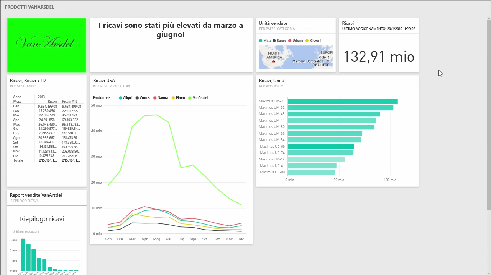
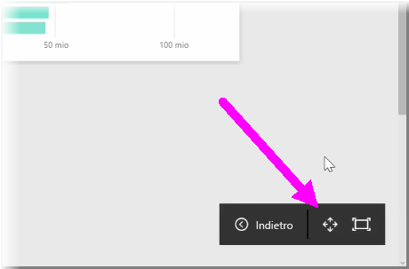

Quando si creano i dashboard, a volte il contenuto può essere più grande dello spazio disponibile nell'area di disegno. Alcune soluzioni aiutano a gestire la visualizzazione dello spazio del dashboard, per poterne visualizzare l'intero contenuto.

Il metodo più semplice per visualizzare l'intero dashboard in un'unica schermata consiste nel selezionare il pulsante della modalità **Schermo intero** nell'angolo in alto a destra del dashboard.

Quando si seleziona il pulsante della modalità **Schermo intero**, il browser passa alla modalità schermo intero, rimuovendo tutti gli elementi dei riquadri nel dashboard e di conseguenza aumentando la quantità di spazio visualizzabile.

Dalla modalità **Schermo intero** è possibile selezionare l'opzione **Adatta allo schermo** per ridurre tutti i riquadri in modo che possano essere contenuti in un'unica schermata, senza che siano necessarie barre di scorrimento. Questa è comunemente definita *modalità TV* ed è utile per l'esecuzione di presentazioni con dashboard o per la visualizzazione di un dashboard su monitor all'ingresso di un edificio.

Un altro modo per gestire lo spazio del dashboard consiste nel comprimere il riquadro di spostamento sul lato sinistro della pagina, selezionando l'icona a tre linee. Per espandere il riquadro di spostamento, fare clic di nuovo sull'icona.

Per fare in modo che un dashboard includa sempre una barra di spostamento compressa, aggiungere quanto segue alla fine dell'URL:

> ?collapseNavigation=true
> 
> 

Gli utenti che seguono questo collegamento apriranno il dashboard con una barra di spostamento compressa.

