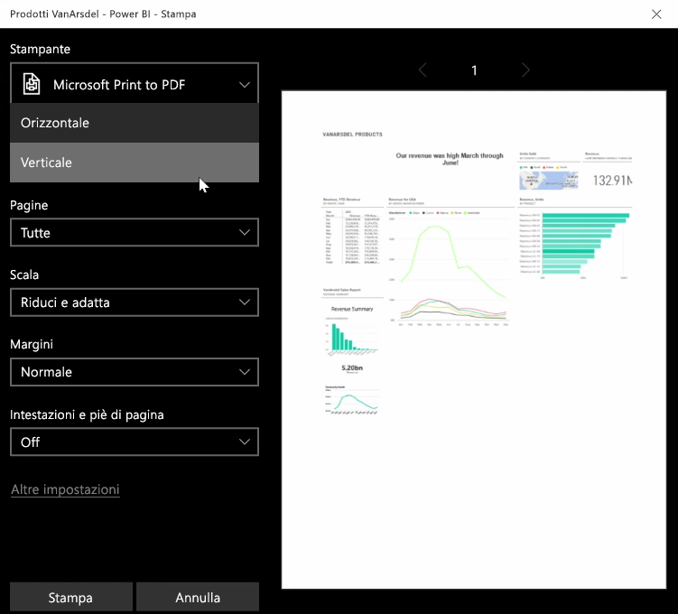

A volte può essere necessario portare un report o un dashboard stampato a una riunione, per poterlo condividere con altri utenti. Con Power BI è possibile creare stampe degli oggetti visivi in alcuni modi diversi.

Nel servizio Power BI selezionare i puntini di sospensione (tre punti) in alto a destra nel servizio e quindi fare clic su **Stampa dashboard**.

Viene visualizzata la finestra di dialogo **Stampa**, in cui è possibile selezionare la stampante a cui inviare il dashboard, nonché alcune opzioni di stampa come l'orientamento *verticale* o *orizzontale*.

## Esportare dati da un oggetto visivo
È anche possibile esportare i dati da qualsiasi oggetto visivo nel servizio Power BI. È sufficiente selezionare i puntini di sospensione in qualsiasi oggetto visivo e quindi fare clic sul pulsante **Esporta dati** (pulsante centrale). A questo punto viene creato e scaricato nel computer locale un file CSV e viene visualizzato un messaggio nel browser (proprio come per qualsiasi altro download avviato dal browser), che indica che il download è completato.

È anche possibile stampare o esportare direttamente da un report. Quando si visualizza un report nel servizio Power BI, selezionare **File > Stampa** per aprire la finestra di dialogo di stampa.

Proprio come con un dashboard, è possibile esportare dati anche da un oggetto visivo in un report, selezionando il pulsante di esportazione nell'oggetto visivo.

