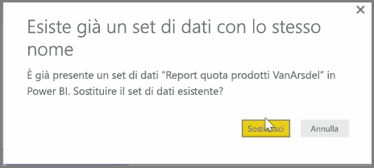
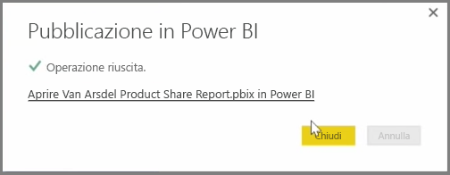

È possibile aggiornare report e set di dati già pubblicati da Power BI Desktop al servizio Power BI. A questo scopo, selezionare **Pubblica** nella scheda **Home** sulla barra multifunzione.

Quando si pubblica un report che esiste già nel servizio Power BI, viene chiesto di confermare se sostituire il set di dati e i report precedenti con la versione modificata che si è appena scelto di aggiornare.

Quando si seleziona **Sostituisci**, i set di dati e i report nel servizio Power BI vengono sovrascritti con quelli presenti nella versione di Power BI Desktop più recente del file.

Come per qualsiasi altro evento **Pubblica** da Power BI Desktop, viene visualizzata una finestra di dialogo che indica che l'evento di pubblicazione è avvenuto correttamente e che contiene un collegamento al report nel servizio Power BI.

Questo è un modo per aggiornare manualmente i dati. È anche possibile aggiornare automaticamente set di dati e report. Questo processo viene descritto in un altro argomento di apprendimento.

