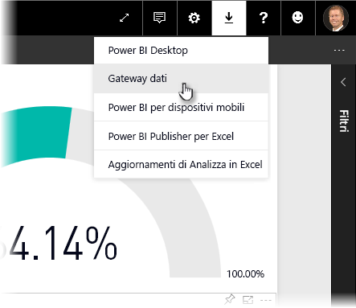
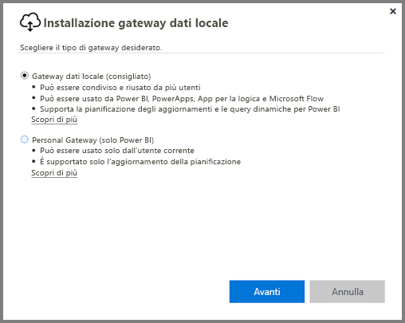
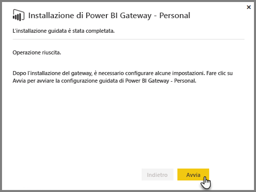
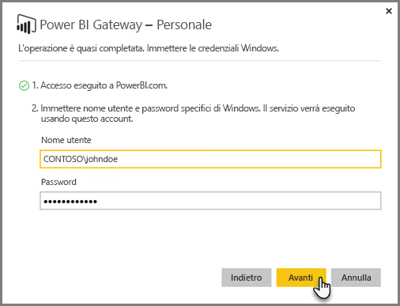
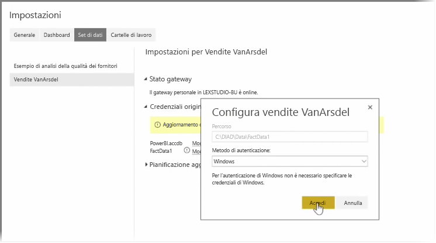
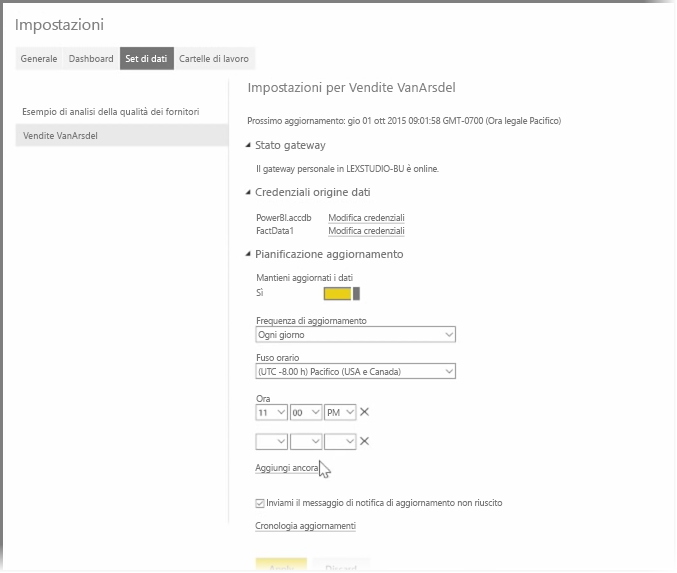

Negli argomenti precedenti abbiamo esaminato come utilizzare Power BI per connettersi alle origini dati e come aggiornare manualmente set di dati nel servizio Power BI. Tuttavia, non si intende eseguire manualmente operazioni di aggiornamento a ogni modifica dei dati, pertanto è possibile utilizzare Power BI per impostare un aggiornamento pianificato che si connetterà alle origini dati e li pubblica nel servizio Power BI automaticamente. Ciò consente inoltre di connettersi al servizio con le origini dati locale, inclusi i file di Excel, i database di Access, database SQL e altro.

Il sistema che consente di connettersi alle origini dati locali per il servizio Power BI viene chiamato **Data gateway**. Si tratta di una piccola applicazione che viene eseguita nel computer e usa una pianificazione preordinata per connettersi ai dati, raccogliere tutti gli aggiornamenti e inviarli al servizio Power BI. Il **gateway personale** è una versione di **Data gateway** che può essere usata senza alcuna configurazione da parte dell'amministratore.

>[!NOTE]
>Per il corretto funzionamento del **gateway personale** il computer che esegue il Power BI Personal Gateway *deve* essere acceso e connesso a Internet.
> 

Per configurare il **gateway personale**, accedere prima al servizio Power BI. Selezionare l’icona **Download** nell'angolo superiore destro della schermata e quindi selezionare **Data Gateway** dal menu.

Da quel punto verrà visualizzata una pagina Web in cui è possibile selezionare il **Gateway Power BI - Personal**, come illustrato di seguito.

Eseguire l'applicazione al termine dell'operazione di download e completare l'installazione guidata.

Verrà quindi richiesto di avviare la Configurazione guidata per configurare il gateway.

Verrà prima richiesto di accedere all'account del servizio Power BI e quindi di accedere all'account Windows del computer, perché il servizio gateway viene eseguito nel proprio account.

Tornare al servizio Power BI. Selezionare il menu di puntini di sospensione (tre punti) accanto a set di dati da aggiornare e quindi selezionare **Pianifica aggiornamenti**. Verrà visualizzata la pagina **Impostazioni di aggiornamento**. Power BI rileva che è installato un **gateway personale** e consente di conoscere lo stato.

Selezionare **Modifica credenziali** accanto a ciascuna origine dati applicabile e configurare l'autenticazione.

Infine, impostare le opzioni disponibili in **Pianifica aggiornamenti** per attivare gli aggiornamenti automatici e impostarne i tempi e la frequenza.

Tutto qui! In corrispondenza degli orari pianificati, Power BI accederà a tali origini dati, usando le credenziali specificate e la connessione al computer in cui è in esecuzione il **gateway personale** e aggiorna i report e i set di dati in base alla pianificazione. La volta successiva che si passa a Power BI, i dashboard, i report e i set di dati rifletteranno i dati, dell'aggiornamento pianificato più recente.

## Passaggi successivi
**Congratulazioni!** Questa sezione **Esplorazione dei dati** del corso di **apprendimento guidato** per Power BI è stata completata. Il servizio Power BI è ricco di modi interessanti per esplorare i dati, condividere le conoscenze e interagire con gli oggetti visivi. Ed è tutto accessibile da un browser, da un servizio a cui è possibile connettersi ovunque ci si trovi.

Un partner noto e potente di Power BI è **Excel**. Power BI ed Excel sono progettati per funzionare correttamente insieme; le cartelle di lavoro conferiranno a Power BI un aspetto familiare ed facile portarle.

Quanto facile? Nella sezione successiva, **Power BI ed Excel** si apprenderà esattamente questo aspetto.

Ci vediamo nella sezione successiva!

