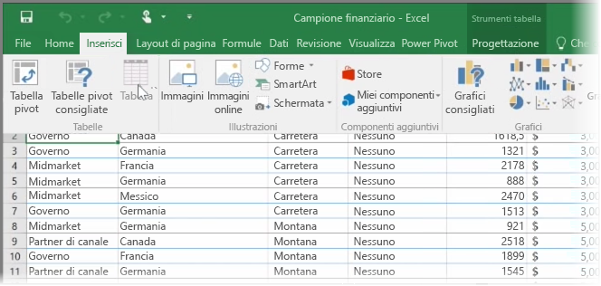
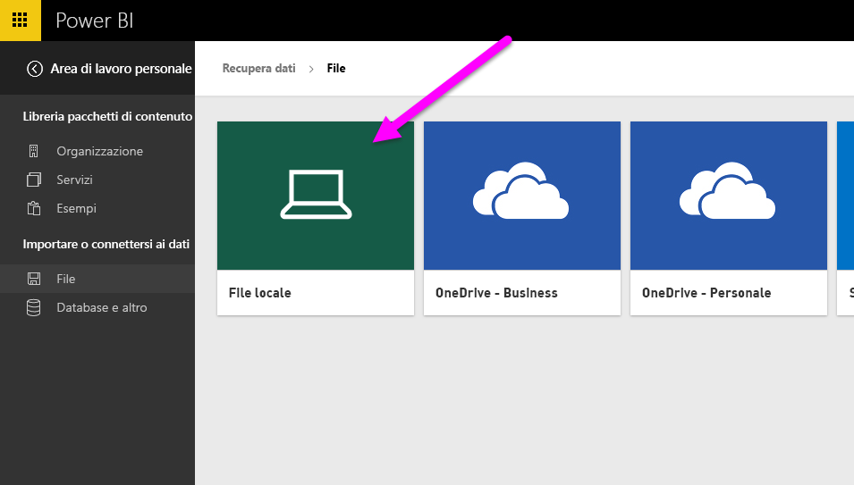
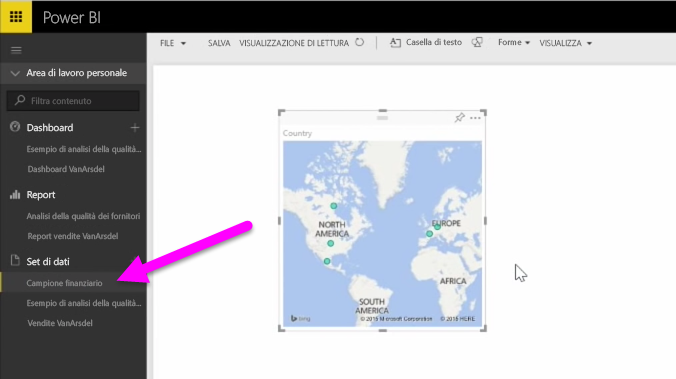

In questo argomento verranno innanzitutto analizzate le modalità di importazione di un file cartella di lavoro di Excel contenente una semplice **tabella** da un'unità locale in Power BI. Si apprenderà quindi come iniziare a esplorare i dati della tabella in Power BI tramite la creazione di un report.

## Verificare che i dati siano formattati come tabella
Per consentire a Power BI di importare dati dalla cartella di lavoro, i dati devono essere **formattati come tabella**. È semplice. In Excel è possibile evidenziare un intervallo di celle, quindi nella scheda **Inserisci** nella barra multifunzione di Excel fare clic su **Tabella**.

È opportuno verificare che ogni colonna abbia un nome valido. Ciò renderà più semplice trovare i dati desiderati durante la creazione di report in Power BI.

## Eseguire l'importazione da un'unità locale
In qualunque posizione si trovino i file Power BI ne semplifica l'importazione. In Power BI è possibile usare **Recupera dati** > **File** > **File locale** per trovare e selezionare il file di Excel desiderato.

Dopo aver importato il file in Power BI, è possibile avviare la creazione di report.

Ovviamente i file non sono devono necessariamente trovarsi in un'unità locale. È preferibile salvare i file in OneDrive o sul sito del team di SharePoint. Questa procedura verrà illustrata nel dettaglio più avanti in questo argomento.

## Avviare la creazione di report
Dopo aver importato i dati della cartella di lavoro, viene creato un set di dati in Power BI. Il set viene visualizzato in **Set di dati**. È ora possibile esplorare i dati tramite la creazione di report e dashboard. È sufficiente fare clic sull'icona del **menu Apri** accanto ai set di dati e scegliere **Esplora**. Viene visualizzata una nuova area di disegno del report vuota. A destra sotto **Campi** vengono visualizzate le tabelle e le colonne. Selezionare i campi di cui che si desidera creare una nuova visualizzazione nell'area di disegno.

È possibile modificare il tipo di visualizzazione e applicare **filtri** e altre proprietà in **Visualizzazioni**.

