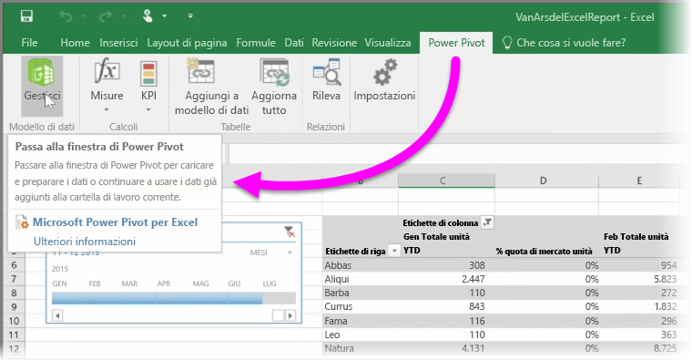

Se si utilizza una delle funzioni BI avanzate di Excel come **Power Query** (chiamato **Recupera e trasforma** in Excel 2016), per eseguire una query e caricare i dati, **Power Pivot** per creare modelli di dati potenti e **Power View** per creare report dinamici, è possibile importare tali file anche in Power BI.

Se si utilizza **Power Pivot** per creare modelli di dati avanzati, ad esempio quelli con più tabelle correlate, misure, colonne calcolate e gerarchie, saranno tutti importati da Power BI ugualmente.

Se la cartella di lavoro contiene **fogli di Power View**, nessun problema. Power BI li crea nuovamente come nuovo **report** in Power BI. È possibile avviare l’aggiunta delle visualizzazioni per i dashboard sin da subito.

Di seguito è una delle eccezionali funzionalità di Power BI: Se si usa Power Query o Power Pivot per connettersi, eseguire una query e caricare i dati da un'origine dati esterna, dopo aver importato la cartella di lavoro in Power BI, è possibile configurare **l'aggiornamento pianificato**. Tramite l'aggiornamento pianificato, Power BI utilizzerà le informazioni di connessione dalla cartella di lavoro per connettersi direttamente all’origine dati ed esegue una query e carica i dati che sono stati modificati. Anche le visualizzazioni nei report verranno aggiornate automaticamente.

